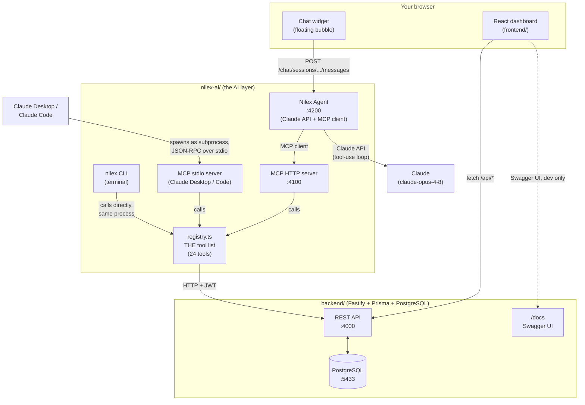
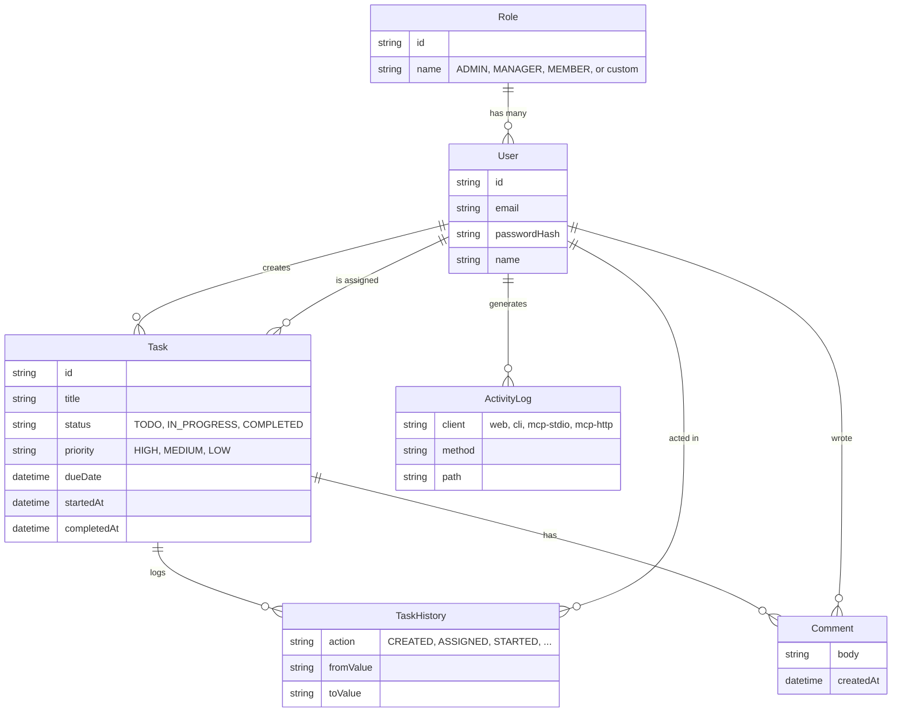

# Nilex AI — The Complete Project Guide

This is the one-stop explainer for the whole project: what it is, why it's
built the way it is, how every piece talks to every other piece, and how to
run it yourself. It's written for two readers at once — if you've never
built anything like this before, the **"In plain English"** boxes are for
you; if you're a developer who wants to know exactly what calls what, keep
reading past them. Nothing here requires reading the other docs first, but
once you're oriented, `README.md` (terse, phase-by-phase changelog),
`nilex-ai/README.md` (deep dive on the AI layer), and
`nilex-ai/src/mcp/MCPReadMe.md` (deep dive on the MCP protocol layer) go
further into their specific corners.

---

## 1. What is this, in one paragraph?

It's a task-management web app — think a small Trello/Asana — with three
things bolted on that most task apps don't have: strict role-based
permissions (who can do what), a full audit trail (who did what, when, from
where), and a **conversational AI assistant** that can read and act on your
tasks in plain English, from inside the dashboard, a terminal, or Claude
Desktop. That assistant isn't a chatbot bolted onto a static FAQ — it's
Claude (Anthropic's LLM) wired up through a real protocol (MCP) to the exact
same operations a human clicks through in the UI, so "ask about your tasks"
and "click around the dashboard" are two doors into the same house.

> **In plain English:** Imagine a to-do list app for a small team. An admin
> creates accounts and tasks, assigns them to people, and can see everything.
> Regular team members only see their own tasks and can mark them started or
> done. On top of that, there's a chat bubble in the corner — type "what's on
> my plate this week?" and it actually looks up your real tasks and answers,
> because it's not guessing, it's calling the same functions the buttons call.

---

## 2. The three layers

```
┌─────────────────────────────────────────────────────────────────┐
│  1. TASK PLATFORM           React dashboard talks to a REST API  │
│     frontend/  +  backend/  backed by PostgreSQL                 │
├─────────────────────────────────────────────────────────────────┤
│  2. DATABASE                 PostgreSQL in Docker, plus pgAdmin  │
│     docker-compose.yml       for browsing it visually            │
├─────────────────────────────────────────────────────────────────┤
│  3. NILEX AI (the AI layer)  MCP server + CLI + Claude-powered   │
│     nilex-ai/                Agent, all built on ONE shared      │
│                               "tool registry"                    │
└─────────────────────────────────────────────────────────────────┘
```

Layer 1 is a complete, working product on its own — you could ship it with
zero AI involved. Layer 3 doesn't duplicate Layer 1's logic; it *reuses* it.
Every single thing the AI can do — list tasks, create one, mark it done — is
implemented exactly once, as a REST endpoint in `backend/`, and the AI layer
just calls that same endpoint. This matters enough to repeat: **there is no
separate "AI version" of the business logic.** The AI can never do something
a human with the same role couldn't also do through the UI, because they're
both hitting the same authorization checks on the same server.

---

## 3. Full architecture



Read it right to left, outside in: **everything ends at the same REST API.**
A human clicking a button, a terminal command, and an LLM deciding to call a
tool all converge on the same `backend/` endpoints, the same Prisma queries,
the same PostgreSQL tables.

---

## 4. Tech stack (for developers)

| Concern | Choice | Why |
|---|---|---|
| Backend framework | [Fastify](https://fastify.dev) (TypeScript) | Fast, schema-first, first-class plugin ecosystem (`@fastify/jwt`, `@fastify/cors`, `@fastify/swagger`) |
| ORM / database | [Prisma](https://prisma.io) + PostgreSQL 16 | Type-safe queries, migrations as code, runs in Docker so nobody needs Postgres installed locally |
| Validation | [Zod](https://zod.dev) | Runtime validation with TypeScript types inferred from the same schema — one definition, not two |
| Auth | JWT (`@fastify/jwt`) + bcrypt password hashing | Stateless tokens; every request re-derives identity from the token, no server-side session store |
| Frontend | React + Vite + TypeScript + Tailwind CSS v4 | Fast dev server, utility-first styling, React Router v7 for navigation |
| AI / LLM | [Claude API](https://docs.anthropic.com) (`claude-opus-4-8`), via the official `@anthropic-ai/sdk`'s Tool Runner | Handles the "ask Claude → it wants to call a tool → run it → tell Claude the result → repeat" loop for you |
| AI ↔ backend bridge | [MCP](https://modelcontextprotocol.io) (`@modelcontextprotocol/sdk`) | The open standard for "here's a list of tools an LLM can call" — same protocol Claude Desktop and Claude Code speak natively |
| CLI | [Commander.js](https://github.com/tj/commander.js) | Subcommands, aliases, `--help` generation |
| API docs | `@fastify/swagger` + `@fastify/swagger-ui` | Auto-generated from the same Zod schemas the routes validate with |
| Containerization | Docker Compose | PostgreSQL + pgAdmin, one command to start both |

---

## 5. Core concepts glossary

> **In plain English first, technical detail after**, for everything you'd
> need to know to read this codebase cold.

- **REST API** — a web server that responds to URLs like `GET /tasks` or
  `POST /tasks` with JSON. *Technical:* `backend/src/routes/*.ts`, one file
  per resource, all mounted onto a single Fastify instance in `server.ts`.
- **JWT (JSON Web Token)** — a signed, tamper-proof string that says "this is
  user X" without the server having to remember anything. You get one back
  from `POST /auth/login`; every later request sends it in an
  `Authorization: Bearer <token>` header. *Technical:* signed/verified by
  `@fastify/jwt` using `JWT_SECRET`; the `authenticate` preHandler in
  `backend/src/middleware/auth.ts` decodes it and attaches
  `request.currentUser`.
- **RBAC (Role-Based Access Control)** — permissions are attached to *roles*
  (ADMIN / MANAGER / MEMBER), not individual users. *Technical:* enforced
  server-side via `requireRole(...)` preHandlers on each route — never just
  hidden in the UI. See §8 for the full permission table.
- **Prisma / ORM** — instead of writing raw SQL, you write
  `prisma.task.findMany({ where: {...} })` and Prisma generates the SQL and
  gives you back fully-typed results. *Technical:* schema lives in
  `backend/prisma/schema.prisma`; every schema change is a versioned
  migration in `backend/prisma/migrations/`.
- **LLM (Large Language Model)** — a model (here, Anthropic's Claude) that
  takes text in and produces text out, trained to be helpful, follow
  instructions, and — critically for this project — decide when to call a
  function it's been told about.
- **Tool / tool-use / function calling** — you hand the LLM a list of
  functions (name, description, expected arguments) alongside your message.
  If it decides one would help answer you, it replies with "call
  `list_my_tasks` with these arguments" instead of (or before) a text
  answer. You run that function yourself and hand the result back; the LLM
  continues from there. This request → tool call → run it → send result back
  → repeat cycle is the **tool-use loop**.
- **MCP (Model Context Protocol)** — a standard way to expose a list of tools
  to *any* LLM client, not just your own code. Instead of hard-coding "here
  are my functions" into one specific app, you run an **MCP server** that
  speaks a common protocol, and any **MCP client** (Claude Desktop, Claude
  Code, or code you write) can discover and call your tools the same way.
  *Technical:* this project's MCP server lives in `nilex-ai/src/mcp/` — see
  `MCPReadMe.md` in that folder for the full protocol-level breakdown
  (transports, sessions, the exact request/response shapes).
- **Tool registry** — this project's single authoritative list of "things
  the system can do" (`nilex-ai/src/registry.ts`): 24 entries, each a name,
  a description, a Zod input schema, and a handler function that calls the
  backend REST API. The MCP server, the CLI, and (indirectly) the Agent are
  all just different front doors onto this one list — add an operation here
  once, and it's instantly available everywhere.
- **Docker / Docker Compose** — packages an application (here, PostgreSQL
  and pgAdmin) with everything it needs so it runs identically on any
  machine, without installing Postgres directly. `docker compose up -d`
  starts both containers, defined in `docker-compose.yml`.

---

## 6. The data model

> **In plain English:** A company (implicitly) has **Roles**. Roles have
> **Users**. Users create and get assigned **Tasks**. Every meaningful thing
> that happens to a task — created, assigned, started, completed — gets
> logged permanently in **Task History**, and people can leave **Comments**
> on a task like a mini discussion thread.



Two tables are easy to mix up, so to be explicit: **`TaskHistory`** is a
system-generated audit log (Fastify writes it automatically every time a
task's status/assignee/details change — you never write to it directly).
**`Comment`** is a human discussion thread (you post to it deliberately, via
the "add a comment" button, or by asking the chat assistant to leave one).
**`ActivityLog`** is a *different* audit trail — not about tasks, but about
every mutating HTTP request across *all three front doors* (web, CLI, MCP),
so an ADMIN can see "who did what, from where" system-wide.

There's also a **`ToolSetting`** table, which isn't part of the task domain
at all — it's how the AI layer's tool registry mirrors itself into the
Admin panel (see §9).

---

## 7. Roles & permissions

| Capability | ADMIN | MANAGER | MEMBER |
|---|---|---|---|
| View all tasks | ✅ | ✅ | ❌ (own only) |
| Create / assign / edit / delete a task | ✅ | ✅ | ❌ |
| Start / complete a task | ✅ any | ✅ any | ✅ own only |
| Comment on a task | ✅ any | ✅ any | ✅ own only |
| View task history | ✅ | ✅ | ✅ own tasks only |
| View the user roster ("Team") | ✅ | ✅ (read-only) | ❌ |
| Create / update / delete users | ✅ | ❌ | ❌ |
| Create / update / delete roles | ✅ | ❌ | ❌ |
| View Reports | ✅ | ✅ | ❌ |
| Manage the AI Tool Registry | ✅ | ❌ | ❌ |
| View the Activity Log | ✅ | ❌ | ❌ |

There's no public sign-up page — accounts are provisioned by an ADMIN, so
role assignment always goes through an authorized path. Every rule in this
table is enforced **server-side** (in the Fastify route handlers), not just
by hiding buttons in the React app — a MEMBER calling the API directly, or
asking the chat assistant to do something outside their role, gets the exact
same 403 either way.

---

## 8. What you can actually do — feature tour

### Dashboard (the web app)

- **Sign in**, land on a role-aware **Dashboard**: stat cards, an
  overdue-tasks alert, and (for ADMIN/MANAGER) a team-workload snapshot and
  14-day completion trend.
- **My Tasks / All Tasks** — a kanban board (To Do / In Progress /
  Completed). Clicking **Start** or **Complete** opens a small dialog where
  you can optionally leave a comment in the same step, then shows a toast
  confirmation ("Task started successfully"). Cards show color-coded
  priority badges and flag overdue tasks in red.
- **Task detail** — click any task title for its full history timeline,
  due date, started/completed timestamps + time taken, and a comment thread
  (both independently scrollable, so a long history doesn't blow out the
  dialog).
- **Notifications** — a bell icon in the header polls every 30 seconds for
  things relevant to you: someone else acted on your task, commented on it,
  or it's approaching/past its due date.
- **Reports** (ADMIN/MANAGER) — status/priority/assignee breakdowns, a
  completion trend chart, overdue count, and average time-to-complete, with
  a raw-data table view as a fallback.
- **Team / Manage Users / Manage Roles / Tool Registry / Activity Log** —
  admin surfaces, gated by the permission table above.
- **The chat widget** — a floating bubble, present on every page once
  logged in, that opens with a smooth bottom-to-top transition. Ask it
  things in plain English; see §9.

### The AI layer (`nilex-ai/`)

- **`nilex` CLI** — a terminal command with short aliases
  (`nilex t la -s TODO`, `nilex t new -t "..." -p high`, etc.), color-coded
  output, and full priority/due-date/comment support. Run `nilex --help`.
- **MCP server** — connect Claude Desktop or Claude Code to it and just ask
  in natural language: *"log me in as admin@example.com / password123, then
  show me every overdue task."*
- **The Nilex Agent** — the thing powering the dashboard's chat widget;
  also runnable as a standalone terminal chat (`nilex chat`) with no
  dashboard involved at all.

---

## 9. How the AI assistant actually works (step by step)

This is the part most worth understanding slowly if you're new to LLM
applications — it's the same shape every "AI that does things" product uses.

> **In plain English:** You type a message. It gets sent, along with a list
> of "things Claude is allowed to do" (the 24 tools), to Anthropic's API.
> Claude reads your message and decides: *do I need to look something up or
> change something before I can answer?* If yes, it doesn't answer yet — it
> replies "I want to call `list_my_tasks`." Your code actually runs that
> function (which calls your real backend, which queries your real
> database), and sends the real result back to Claude. Claude reads that
> and either calls another tool or gives you its final answer. You never see
> the intermediate "I want to call X" step — the app just shows a small
> "using `list_my_tasks`..." indicator while it's happening, then streams in
> the final reply.

Technically, here's the exact chain for a dashboard chat message:

1. **`ChatWidget.tsx`** (React) sends your message to the **Nilex Agent**'s
   HTTP service (`nilex-ai/src/agent/server.ts`), which holds one
   `AgentSession` per open conversation.
2. **`AgentSession`** (`nilex-ai/src/agent/agentSession.ts`) is itself an
   **MCP client** — it connects to this project's own MCP server
   (`nilex-ai/src/mcp/http.ts`) over the network, exactly like Claude
   Desktop would, just over HTTP instead of spawning a subprocess.
3. It hands your message plus the live MCP tool list to the **Claude API's
   Tool Runner** (`client.beta.messages.toolRunner`) — a helper from
   Anthropic's SDK that automates the request → tool call → run it → send
   result back → repeat loop, so nobody had to hand-write that loop.
4. When Claude decides to call a tool, the Tool Runner calls it *through the
   MCP connection* — which lands on `registerTools.ts`, which looks up the
   matching entry in `registry.ts`, which makes an authenticated HTTP call
   to the **same REST API** the dashboard itself uses.
5. The result flows back up the same chain, Claude either calls another tool
   or writes its final answer, and that streams back to the browser
   token-by-token over a chunked HTTP response.

Every step of that chain is documented in depth, with sequence diagrams, in
`nilex-ai/src/mcp/MCPReadMe.md` (steps 2–4) and `nilex-ai/README.md`'s
"Nilex Agent" section (steps 1, 3, 5).

**Why does the dashboard chat never ask you to log in?** Because step 1
already knows who you are (your dashboard JWT is sitting in `localStorage`).
It's silently handed to the MCP session via a `login_with_token` call before
you ever type a message — and once that's happened, the `login`/`logout`
tools are hidden from Claude entirely for that conversation, so it can't
accidentally ask you to retype a password into the chat, or log the session
out with no way back in. (The CLI and Claude Desktop *do* need natural-
language login — they have no dashboard session to borrow from.)

---

## 10. Governance: the Admin Tool Registry

> **In plain English:** An ADMIN can turn off individual AI capabilities —
> say, disable "delete a user" for the AI/CLI without touching any code and
> without affecting the actual "delete user" button in the dashboard.

Every MCP process pushes its own tool list to the backend on startup
(`POST /tool-settings/sync`), so the `ToolSetting` database table always
mirrors `registry.ts` automatically — nobody hand-maintains two lists. The
dashboard's **Tool Registry** admin page reads that table and lets an ADMIN
flip a tool off; the next time any client logs in, it fetches the current
enabled/disabled map and every future call to a disabled tool is refused
*before* it ever reaches the backend. Separately, every mutating request —
from the dashboard, the CLI, or an MCP tool call — is tagged with which
front door it came through and logged to the **Activity Log**, so an admin
can see everything happening across the whole system in one place.

---

## 11. Project structure

```
MCPServer/
├── README.md                    ← terse, phase-by-phase technical changelog
├── NILEXAIReadMe.md              ← you are here
├── docker-compose.yml            ← PostgreSQL + pgAdmin
├── pgadmin-servers.json          ← pre-registers the DB connection in pgAdmin
│
├── backend/                      ← REST API (Fastify + Prisma + PostgreSQL)
│   ├── prisma/
│   │   ├── schema.prisma         ← the data model (source of truth)
│   │   ├── migrations/           ← versioned schema history
│   │   └── seed.ts               ← sample roles/users/tasks
│   └── src/
│       ├── server.ts             ← boots Fastify, registers everything
│       ├── middleware/auth.ts    ← authenticate + requireRole
│       ├── lib/                  ← prisma client, activity-log descriptions
│       └── routes/                ← one file per resource (auth, tasks, users, roles, ...)
│
├── frontend/                     ← React + Vite + Tailwind dashboard
│   └── src/
│       ├── components/            ← Modal, TaskBoard, ChatWidget, ToastProvider, ...
│       ├── pages/                 ← Dashboard, MyTasks, AllTasks, Reports, ...
│       └── lib/                   ← api.ts, auth.tsx, chatApi.ts, permissions.ts
│
└── nilex-ai/                     ← the AI layer
    └── src/
        ├── registry.ts            ← THE tool list (24 tools) — single source of truth
        ├── mcp/                   ← MCP server (stdio + HTTP transports)
        │   └── MCPReadMe.md       ← deep technical dive on this specific folder
        ├── cli/                   ← the `nilex` terminal command
        ├── agent/                 ← the Claude-powered conversational Agent
        └── lib/                   ← session state, backend HTTP client, env loading
```

---

## 12. Running it yourself

```sh
# 1. Database
docker compose up -d postgres      # PostgreSQL on :5433
# optional: docker compose up -d pgadmin   # browse it visually at :5050

# 2. Backend
cd backend
npm install
npm run prisma:migrate             # creates the schema
npm run seed                       # sample roles/users/tasks
npm run dev                        # http://localhost:4000

# 3. Frontend (separate terminal)
cd frontend
npm install
npm run dev                        # http://localhost:5173

# 4. AI layer (optional, only needed for the chat widget / CLI / MCP)
cd nilex-ai
npm install
cp .env.example .env               # set TOOL_SYNC_KEY (must match backend's) + ANTHROPIC_API_KEY
npm run build
npm run mcp:http                   # MCP server on :4100
npm run agent:server               # Agent HTTP service on :4200 (separate terminal)
```

Seeded logins (password `password123`): `admin@example.com`,
`manager@example.com`, `member@example.com`.

| Service | URL |
|---|---|
| Dashboard | http://localhost:5173 |
| Backend API | http://localhost:4000 |
| **API docs (Swagger UI)** | **http://localhost:4000/docs** |
| pgAdmin | http://localhost:5050 |
| MCP server (Streamable HTTP) | http://localhost:4100/mcp |
| Nilex Agent (chat backend) | http://localhost:4200 |

---

## 13. Security notes (read before deploying anywhere real)

- Every role check happens **server-side**; the frontend hiding a button is
  a UX nicety, never the actual security boundary.
- Passwords are hashed with bcrypt; JWTs are signed with `JWT_SECRET`
  (never commit real secrets — `.env` files are gitignored throughout).
- `POST /tool-settings/sync` uses a **shared secret** (`X-Sync-Key`), not a
  user JWT — there's no "acting human" for a service announcing its own
  tool list at boot.
- `/docs` (Swagger UI) is unauthenticated *to view* — standard for a
  local/dev API, but worth gating or disabling before any real deployment.
- **Known issue, flagged not fixed:** `npm audit` on `backend/` reports
  critical CVEs in `fast-jwt` (a transitive dependency of `@fastify/jwt`).
  Fixing it means upgrading `@fastify/jwt` to a new major version — a
  breaking change deliberately left for a deliberate decision, not applied
  silently.

---

## 14. Where to go from here

- **`README.md`** — the terse, authoritative changelog: what shipped in
  each phase, the full API surface list, exact commands.
- **`nilex-ai/README.md`** — everything about the AI layer in depth:
  the tool registry table, `node` vs `nilex` as a launch command, wiring up
  Claude Desktop/Code, the Agent's HTTP API with `curl` examples, the CLI's
  full command reference (required vs. optional flags, worked examples).
- **`nilex-ai/src/mcp/MCPReadMe.md`** — protocol-level detail on exactly
  how the MCP stdio and HTTP servers work, with sequence diagrams.
- **http://localhost:4000/docs** — try every backend endpoint yourself,
  interactively, once the backend is running.
