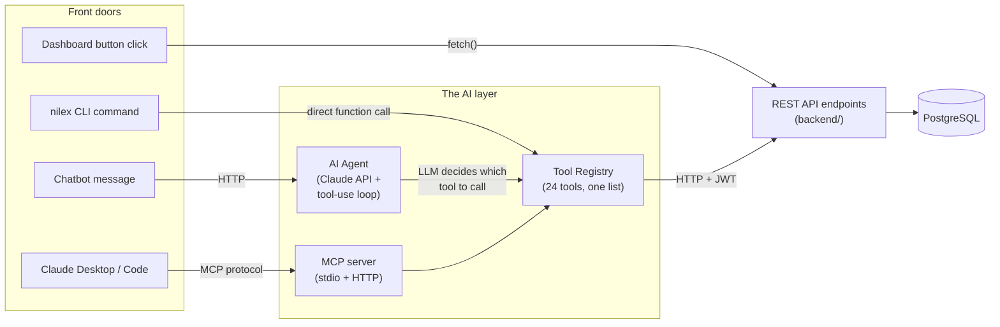
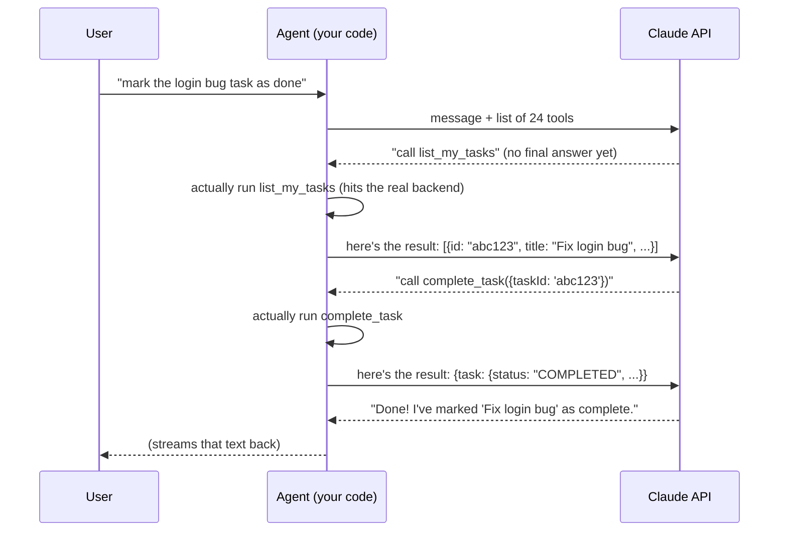
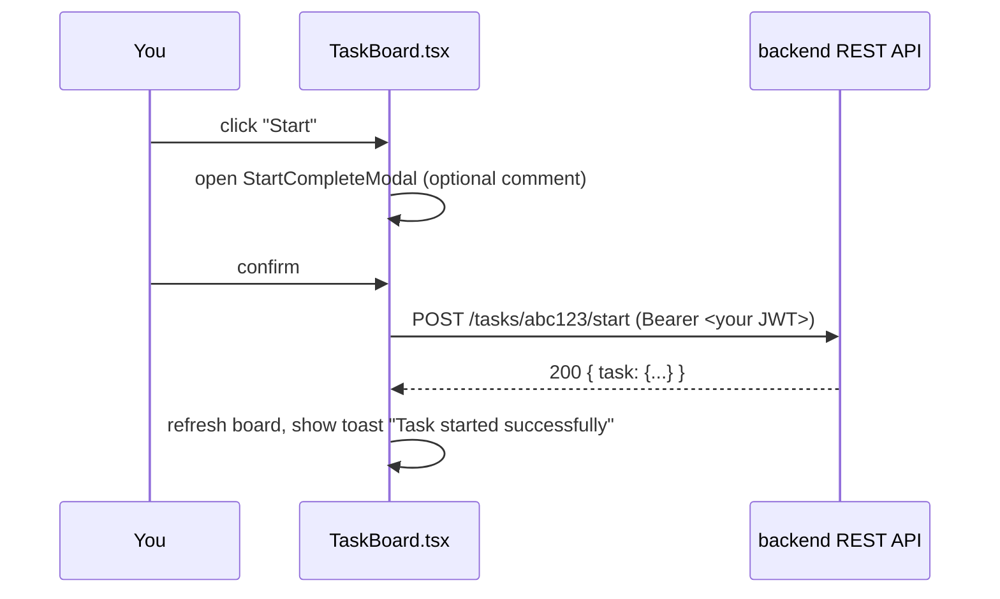
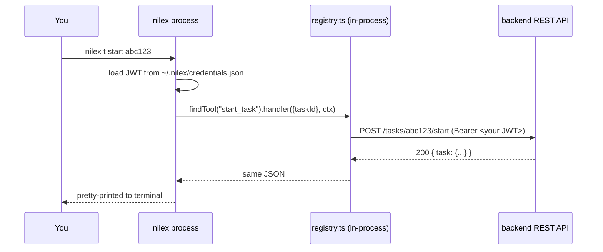
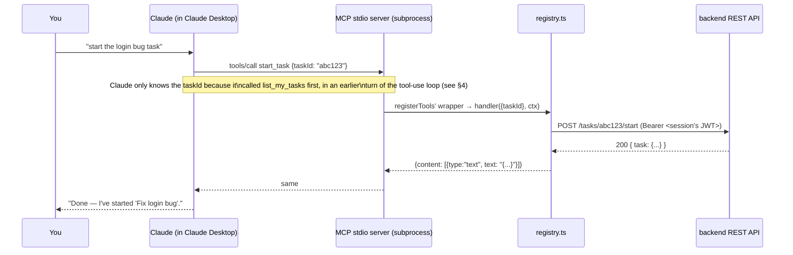
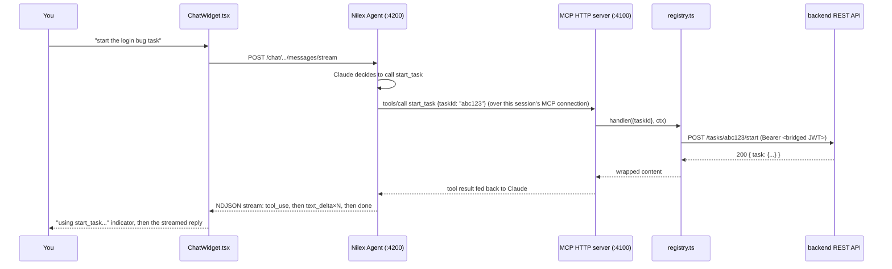

# Nilesx AI — Concept Overview: MCP, LLM, Agent, Tool Registry, CLI, API, Chatbot

`NILEXAIReadMe.md` tours the *project* — what's in each folder, how to run
it. This document instead tours the **concepts**, one at a time, in detail,
and then shows how they connect by tracing one single action — *starting a
task* — through all four ways this system can do it. If you read nothing
else, read §9: it's the same operation, four times, and by the fourth one
every concept above it should click into place.

---

## 1. The concept map



Four **front doors** (top row) — a human, a terminal, a chat message, or an
external LLM app — all end up going through the **AI layer** in the middle,
which itself always ends at the same **REST API** at the bottom. The CLI is
actually the odd one out here: it doesn't go through MCP at all, it calls
the registry's functions directly in the same process (see §5). Everything
else does route through MCP in some form.

---

## 2. LLM — Large Language Model

**In plain English:** a model that reads text and predicts what text should
come next, trained on enormous amounts of writing until it gets extremely
good at that. Ask it a question, it predicts a good answer, one token
(roughly, one word-piece) at a time. This project uses **Claude**
(specifically `claude-opus-4-8`), Anthropic's model, via the official
`@anthropic-ai/sdk`.

**Why an LLM alone isn't enough for this project:** a plain LLM only knows
what was in its training data plus whatever you put in the prompt. It has
no idea what tasks exist in *your* database right now, and it can't create
one — it can only produce text. To let it actually *do* things, you give it
**tools** (§4/§5) — and an LLM that's been given tools and the ability to
use them in a loop is what people call an **agent** (§4).

**Concretely, in this project:** every message sent to Claude includes:

```ts
// nilex-ai/src/agent/agentSession.ts
const runner = getAnthropicClient().beta.messages.toolRunner({
  model: "claude-opus-4-8",
  max_tokens: 8192,
  system: SYSTEM_PROMPT,          // "You are Nilex AI, the assistant for..."
  thinking: { type: "adaptive" },
  tools: this.tools,               // the 24 (or fewer, if bridged — see §6) MCP tools
  messages: this.messages,         // the whole conversation so far
});
```

Claude reads `system` + `messages` + the list of `tools`, and either replies
with text, or replies "I want to call tool X with arguments Y" — which is
where the tool-use loop (§4) picks up.

---

## 3. Tool Registry — the one source of truth

**In plain English:** a phone book of every action this system can perform.
Not a phone book of *code* — a phone book of *descriptions*, written so
both a human developer and an LLM can read an entry and understand exactly
what it does and what information it needs.

**Where it lives:** `nilex-ai/src/registry.ts` — one TypeScript array,
24 entries, grouped into four categories (Session, Tasks, Users, Roles).
Here's one real entry, unabridged:

```ts
defineTool({
  name: "start_task",
  description:
    "Move a task from TODO to IN_PROGRESS. A MEMBER may only start a task " +
    "assigned to them; ADMIN and MANAGER may start any task.",
  category: "Tasks",
  inputShape: { taskId: z.string().describe("Task ID") },
  handler: async ({ taskId }, ctx) => {
    requireAuth(ctx);
    return apiRequest(ctx, `/tasks/${taskId}/start`, { method: "POST" });
  },
}),
```

Four parts, every single entry:

| Part | Purpose |
|---|---|
| `name` | A stable, unique identifier — `start_task`, never renamed casually, since every client (CLI, MCP, docs) refers to tools by this string |
| `description` | **Written for the LLM.** This is the sentence Claude reads to decide *when* to call this tool. Vague descriptions produce a confused agent; this one explicitly states the RBAC rule so Claude doesn't need to guess or trial-and-error |
| `inputShape` | A Zod schema. Used three ways at once: (1) turned into the JSON Schema an LLM sees so it knows what arguments to send, (2) validates real input at runtime, (3) gives TypeScript full autocomplete/type-checking on `handler`'s arguments |
| `handler` | The actual implementation — always ends in a call to `apiRequest()`, i.e. an authenticated HTTP call to the backend REST API (§7) |

**Why one list, not three?** Because the CLI, the MCP server, and (through
the MCP server) the Agent all `import { registry } from "../registry.js"`
and loop over the exact same array. Add a 25th tool here once, and the CLI
gets a new command's worth of capability, the MCP server exposes it to
Claude Desktop, and the chatbot can use it — all without touching three
separate files.

**Governance layer:** every non-`essential` tool (everything except
`login`/`logout`/`whoami`/`login_with_token`) can be individually disabled
by an ADMIN from the dashboard's Tool Registry page, without touching this
file — see §10 of `NILEXAIReadMe.md` for the full mechanism.

---

## 4. AI Agent — what makes it an "agent," not just a chatbot

**In plain English:** a chatbot answers from what it already knows. An
**agent** can *act* — look things up, make changes, check the result, and
decide what to do next — in a loop, without you manually feeding it each
step. The loop itself is the whole trick:



Every `A->>A` step in that diagram is a **real** side effect against your
**real** database — not the LLM imagining what would happen. That's the
entire point of tool use: the LLM makes *decisions* ("which tool, with what
arguments"), your code does the *doing*.

**This project's specific agent** is `AgentSession`
(`nilex-ai/src/agent/agentSession.ts`). It doesn't implement that loop by
hand — it hands the whole thing to the Claude API SDK's **Tool Runner**
(`client.beta.messages.toolRunner(...)`), which automates exactly the
`C-->>A` / `A->>A` / `A->>C` cycle above until Claude produces a final text
answer instead of another tool call (capped at `max_iterations: 10` so a
confused loop can't run forever).

**Two ways to reach this agent:**

- `npm run agent:server` — an HTTP service (`nilex-ai/src/agent/server.ts`),
  one `AgentSession` per browser tab's conversation, kept in memory. This is
  what the dashboard's chat widget talks to (§8).
- `nilex chat` — a terminal REPL (`nilex-ai/src/agent/repl.ts`) wrapping the
  exact same `AgentSession` class, for chatting without any UI at all.

---

## 5. MCP — Model Context Protocol

**In plain English:** before MCP, every app that wanted an LLM to call
custom functions had to invent its own private way of doing it. MCP is a
shared, open standard for "here is a list of tools, here's how to call one,
here's how results come back" — so *any* MCP-speaking client (Claude
Desktop, Claude Code, or code you write) can plug into *any* MCP server
without custom integration work on either side.

**The three pieces:**

- **MCP server** — hosts the tools, executes them when asked. Has zero
  intelligence of its own; it's a dumb, reliable adapter. This project's
  server (`nilex-ai/src/mcp/`) just forwards every call straight to
  `registry.ts`.
- **MCP client** — the thing deciding *which* tools to call: Claude Desktop,
  Claude Code, or this project's own `AgentSession` (§4). The client reads
  each tool's `description`, decides what's relevant to what the user
  asked, and calls it.
- **Transport** — how client and server physically exchange messages. This
  project runs **both**:
  - **stdio** — the client spawns the server as a local subprocess and
    talks JSON-RPC over stdin/stdout. What Claude Desktop and Claude Code
    use (`nilex-ai/src/mcp/stdio.ts`).
  - **Streamable HTTP** — the server runs as a standing network service;
    many clients can connect concurrently, each gets its own isolated
    session (`nilex-ai/src/mcp/http.ts`, port `4100`). What the Agent uses.

**What a tool call looks like on the wire** (simplified — the real JSON-RPC
envelope has more bookkeeping fields, but this is the shape that matters):

```jsonc
// Client → Server
{
  "method": "tools/call",
  "params": {
    "name": "start_task",
    "arguments": { "taskId": "abc123" }
  }
}

// Server → Client
{
  "result": {
    "content": [{ "type": "text", "text": "{\"task\": {\"id\": \"abc123\", \"status\": \"IN_PROGRESS\", ...}}" }],
    "isError": false
  }
}
```

That `content`/`isError` shape is exactly what `registerTools.ts` builds
around every `registry.ts` handler's return value — see
`nilex-ai/src/mcp/MCPReadMe.md` for the full protocol-level walkthrough,
including session lifecycle diagrams.

**Sessions, disambiguated** (this project has three things called
"session," and they're genuinely different — worth being precise):

| Term | What it tracks | Lifetime |
|---|---|---|
| **MCP session** | One connected client's `Mcp-Session-Id` (HTTP transport only; stdio has no separate concept, the process *is* the session) | Until the client disconnects or the server restarts |
| **`SessionContext`** | This project's own auth state object: `{token, user, clientLabel, toolSettings}` | One per MCP session (HTTP) or per process (stdio) or per CLI invocation (loaded from disk) |
| **`AgentSession`** | One chat conversation's message history + its own MCP *client* connection | One per open chat (browser tab or terminal REPL) |

---

## 6. Frontend Chatbot — the dashboard's chat widget

**In plain English:** a floating chat bubble that's on every page once
you're logged in. You never have to log in again inside it — it silently
reuses your dashboard login.

**Step by step, what happens when you send a message:**

1. `ChatWidget.tsx` calls `POST /chat/sessions` on the Agent's HTTP service
   (port `4200`), attaching your dashboard's JWT as
   `Authorization: Bearer <token>`.
2. The Agent creates a new `AgentSession`. Before anything else, it calls
   the `login_with_token` tool **directly** (bypassing Claude entirely —
   there's no decision to make, you're already who you are). This
   *bridges* your dashboard identity into the MCP session.
3. Because that session is now "bridged," `AgentSession` removes `login`
   and `logout` from the list of tools Claude can see for the rest of that
   conversation — so it can never ask you to retype a password, and it can
   never accidentally log the session out with no way back in.
4. Your message goes to `POST /chat/sessions/:id/messages/stream`. The
   response is **NDJSON** (newline-delimited JSON) — one JSON object per
   line, streamed as Claude produces them:
   ```
   {"type":"tool_use","name":"list_my_tasks"}
   {"type":"text_delta","text":"You"}
   {"type":"text_delta","text":" have"}
   {"type":"text_delta","text":" 3 tasks..."}
   {"type":"done"}
   ```
   (Not formal Server-Sent Events — the browser's `EventSource` API can't
   POST a body or send an `Authorization` header, so the frontend hand-reads
   the stream via `fetch()` + a `ReadableStream` reader either way, making
   NDJSON simpler than SSE's framing for no extra cost.)
5. The widget renders `text_delta` events as they arrive (so replies appear
   to type themselves) and shows a live "using `list_my_tasks`..." indicator
   the instant a `tool_use` event arrives — *before* the tool has even
   finished running, so the UI never looks frozen mid-lookup.
6. The chat panel itself opens with a bottom-to-top slide/fade transition
   (`ChatWidget.tsx`'s `open` state toggles Tailwind transform/opacity
   classes rather than the DOM node just appearing).
7. If you log into a *different* dashboard user, or log out, the widget's
   stale session (if any) is discarded (`discardChatSessionIfStale()` in
   `frontend/src/lib/chatApi.ts`) so the next message starts a fresh,
   correctly-bridged conversation instead of silently continuing to act as
   whoever was logged in before.

---

## 7. API Endpoints — the REST layer everything converges on

**In plain English:** a URL you can send an HTTP request to, that does one
specific thing and gives you back JSON. `POST /tasks/:id/start` — "start
this task" — is one; there are 30 total, across 8 resource areas (auth,
tasks, users, roles, tool-settings, activity-log, notifications, reports).

**Every endpoint follows the same shape:**

```
POST /tasks/:id/start
Authorization: Bearer <jwt>

→ 200 OK
{ "task": { "id": "abc123", "status": "IN_PROGRESS", "startedAt": "2026-07-..." } }
```

1. **`authenticate`** preHandler decodes the JWT, attaches
   `request.currentUser`, or fails with 401.
2. **`requireRole(...)`** preHandler (where applicable) checks the user's
   role against what's allowed, or fails with 403 — see the permission
   table in `NILEXAIReadMe.md` §7.
3. The **route handler** validates the body/params with Zod, runs the
   Prisma query, and (for mutations) writes a `TaskHistory` row.
4. A **global `onResponse` hook** logs every mutating request to
   `ActivityLog`, tagged with which front door it came from
   (`X-Nilex-Client: web | cli | mcp-stdio | mcp-http`).

**Explore it yourself, interactively:** every endpoint — with request/
response schemas generated from the same Zod objects the routes validate
with — is browsable and callable at **http://localhost:4000/docs** (Swagger
UI). Click **Authorize**, paste a JWT from `POST /auth/login`, and you can
fire real requests from the browser without writing any code.

---

## 8. CLI — `nilex` on the terminal

**In plain English:** a command-line program that does the *same* things
the dashboard buttons and the chatbot do, typed instead of clicked or
chatted.

**The key architectural fact:** the CLI does **not** go through MCP. It
imports `registry.ts` and calls a tool's `handler` function directly, in
the same Node.js process — no protocol, no network hop to an MCP server.

```ts
// nilex-ai/src/cli/index.ts (simplified)
async function run(name: string, args: Record<string, unknown>) {
  const tool = findTool(name);              // look it up in registry.ts
  const ctx = sessionFromDisk();            // load ~/.nilex/credentials.json
  const result = await tool.handler(args, ctx);  // call it directly
  print(result);
}
```

Since each CLI invocation is a fresh OS process (unlike MCP's one
long-lived session per client), the session token lives on disk between
commands instead of in memory — `nilex login` writes it,
`~/.nilex/credentials.json` remembers it, every later command reads it back.

**Example: starting a task from the terminal:**

```sh
$ nilex login
Email: admin@example.com
Password: ********
Logged in as Alice Admin (ADMIN)

$ nilex t lm
PRIORITY  STATUS   TITLE                  DUE         ASSIGNEE     ID
HIGH      TODO     Fix login bug          Jul 20      Alice Admin  abc123...

$ nilex t start abc123
{
  "task": { "id": "abc123...", "status": "IN_PROGRESS", "startedAt": "..." }
}
```

Full command reference (every flag, required vs. optional, worked examples
for each) lives in `nilex-ai/README.md`'s "Using the CLI" section.

---

## 9. Putting it all together: one action, four ways

Everything above is easiest to hold in your head as **one concrete action**
— *starting task `abc123`* — traced through all four front doors. Same
`registry.ts` entry, same `POST /tasks/:id/start` endpoint, same
`TaskHistory` row written, four completely different entry points.

### A. Dashboard button click



### B. `nilex` CLI



### C. Claude Desktop (natural language, via MCP)



### D. Dashboard chatbot (natural language, via the Agent)



**What's identical across all four:** the `POST /tasks/abc123/start` call,
the RBAC check, the `TaskHistory` row it writes, the `ActivityLog` entry
(tagged `web`, `cli`, `mcp-stdio`, or `mcp-http` respectively). **What's
different:** only the path *to* that call — a click, a typed command, a
subprocess speaking MCP over stdio, or a chat message routed through the
Agent's own MCP-over-HTTP connection. That's the entire architecture of
this project in one sentence: **one action, one authorization boundary, one
audit trail — reachable four ways.**

---

## 10. Quick-reference table

| Concept | One-line definition | Lives in |
|---|---|---|
| LLM | The model (Claude) that reads text and decides things, including which tools to call | Anthropic's API — not part of this codebase |
| Tool | One named, described, schema'd, callable action | `nilex-ai/src/registry.ts` |
| Tool Registry | The full list of all 24 tools — the single source of truth | `nilex-ai/src/registry.ts` |
| MCP | The protocol standardizing how a client discovers and calls an LLM's tools | `nilex-ai/src/mcp/` |
| MCP server | Hosts the tools, executes calls, has no intelligence of its own | `nilex-ai/src/mcp/stdio.ts`, `http.ts` |
| MCP client | Decides which tool to call, when | Claude Desktop / Claude Code / `AgentSession` |
| AI Agent | An LLM + tools + a loop that lets it act, not just answer | `nilex-ai/src/agent/agentSession.ts` |
| Tool-use loop | Ask → tool call requested → run it → send result back → repeat | Automated by the Claude API's Tool Runner |
| CLI | Terminal command hitting the registry directly, no MCP involved | `nilex-ai/src/cli/index.ts` |
| API endpoint | One REST URL + method that everything eventually calls | `backend/src/routes/*.ts` |
| Frontend Chatbot | The dashboard's floating widget, talking to the Agent over HTTP | `frontend/src/components/ChatWidget.tsx` |

For setup instructions and the full project tour, see `NILEXAIReadMe.md`.
For protocol-level MCP detail (session maps, transport internals,
troubleshooting), see `nilex-ai/src/mcp/MCPReadMe.md`. For the complete CLI
command reference, see `nilex-ai/README.md`.
