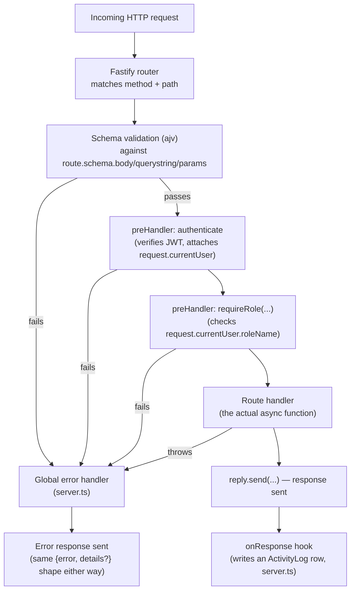

# FASTIFYReadMe — Fastify Guide + `auth.ts` Explained Line by Line

Two things in one document: (1) a general guide to Fastify — what it is,
how to start a project from scratch, this project's architecture and folder
structure — and (2) a **line-by-line walkthrough of every single line** in
`backend/src/routes/auth.ts`, the smallest complete route file in the
project and a genuinely representative example of every pattern the other
seven route files repeat. Read §1–§5 first if Fastify is new to you; jump
straight to §6 if you just want the file explained. Two definitions per
concept throughout: **Technical**, then **Natural Language**.

---

## 1. What is Fastify?

**Technical:** a Node.js web framework focused on low overhead and a
plugin-based architecture. Every meaningful piece of functionality — CORS,
JWT auth, Swagger docs — is added by *registering a plugin* onto a Fastify
*instance*, rather than being baked into the framework core. Route handlers
are `async` functions; validation is schema-driven (JSON Schema, checked by
the bundled `ajv` validator) rather than hand-written `if` checks; logging
(Pino) is built in, not bolted on.

**Natural Language:** it's the framework this project's entire backend runs
on — the thing that turns "an HTTP request arrived" into "the right piece
of your code ran, with the right data, and a response went back." Compared
to something like Express (an older, more common alternative), Fastify is
faster and pushes you toward validating input by *describing its shape*
(a schema) instead of writing manual checks for every field.

---

## 2. Starting a Fastify project from scratch

**Technical / generic bootstrap** (not this project's exact history, but
what creating an equivalent project from zero looks like):

```sh
mkdir my-api && cd my-api
npm init -y
npm install fastify
npm install -D typescript tsx @types/node

npx tsc --init      # or hand-write a tsconfig.json — see §4's copy
mkdir src
```

### Every line of that, explained

**`mkdir my-api && cd my-api`**
**Technical:** creates an empty directory and changes into it; `&&` runs
the second command only if the first succeeds, so you never `cd` into a
directory that failed to get created.
**Natural Language:** makes a new empty folder for the project and steps
inside it — nothing framework-specific yet, just a clean place to start.

**`npm init -y`**
**Technical:** generates a `package.json` file — the manifest every Node.js
project needs, listing the project's name, version, dependencies, and
scripts. `-y` ("yes") accepts every default value instead of interactively
asking you name/version/description/etc. one at a time.
**Natural Language:** this is the file that makes the folder "a Node.js
project" at all — without it, `npm install` has nowhere to record what got
installed.

**`npm install fastify`**
**Technical:** downloads the `fastify` package into a new `node_modules/`
folder and adds it to `package.json`'s **`dependencies`** — the list of
packages needed to actually *run* the app in production.
**Natural Language:** this is the one package that matters most — the web
framework itself.

**`npm install -D typescript tsx @types/node`**
**Technical:** installs three packages as **`devDependencies`** (the `-D`
flag) — things needed while *building/running in development*, but not
shipped as part of what production needs conceptually (in practice, this
project's production `start` script still runs compiled output, so the
distinction matters more for clarity and for tools that prune dev deps
before deploying than for anything else here):

| Package | What it's for |
|---|---|
| `typescript` | The TypeScript compiler (`tsc`) — turns `.ts` source into plain `.js` |
| `tsx` | Runs `.ts` files **directly**, compiling on the fly in memory — what `npm run dev` uses, so you never manually compile while developing |
| `@types/node` | Type definitions for Node's *built-in* APIs (`fs`, `path`, `process`, ...) — without this, TypeScript has no idea what shape `process.env` or `require` have |

**Natural Language:** none of these three end up doing anything for your
actual users — they're tools *you* use while writing and running the code:
one translates TypeScript to JavaScript, one lets you skip that translation
step during day-to-day development, and one teaches the type-checker about
Node itself.

**`npx tsc --init`**
**Technical:** `npx` runs a package's command-line tool without installing
it globally — here, it runs the `tsc` binary that `npm install -D
typescript` just placed in `node_modules/.bin/`. `--init` generates a
starter `tsconfig.json` with every option present but most commented out
and explained inline (this project's own `tsconfig.json`, fully explained
in §4, is a hand-trimmed version of exactly that file).
**Natural Language:** creates the settings file that tells the TypeScript
compiler how strict to be, which JavaScript version to target, and where
your source files live versus where compiled output should go.

**`mkdir src`**
**Technical:** creates the folder this project's `tsconfig.json` (and the
generated one) expects source files to live in — matching
`"rootDir": "src"` (see §4).
**Natural Language:** just a folder to keep your actual code in, separate
from config files and (later) the compiled output.

```ts
// src/server.ts — the smallest possible Fastify server
import Fastify from "fastify";

const app = Fastify({ logger: true });

app.get("/health", async () => ({ status: "ok" }));

await app.listen({ port: 3000 });
```

```sh
npx tsx src/server.ts        # run it directly, TypeScript and all
```

**Natural Language:** at minimum, a Fastify project is one dependency
(`fastify` itself) and a few lines of code. Everything else — a database,
auth, validation, docs — gets layered on by installing and registering more
plugins, one at a time, which is exactly how this project actually grew
(see the `README.md` phase history: Phase 1 was just auth + tasks; Swagger
was added much later, as its own plugin, without touching how any existing
route worked).

**This project's actual commands** (`backend/package.json`):

```sh
npm install              # installs fastify, @fastify/cors, @fastify/jwt,
                          # @fastify/swagger, @fastify/swagger-ui, prisma, zod, bcryptjs
npm run dev               # tsx watch src/server.ts — auto-restarts on file changes
npm run build              # tsc -p tsconfig.json — compiles src/ → dist/
npm run start               # node dist/server.js — runs the compiled build
npm run prisma:migrate       # applies/creates database migrations
npm run seed                  # populates sample roles/users/tasks
```

---

## 3. Folder structure

```
backend/
├── .env                       ← DATABASE_URL, JWT_SECRET, TOOL_SYNC_KEY, PORT (gitignored)
├── .env.example                ← the same keys, no real values — safe to commit
├── package.json
├── tsconfig.json                ← see §4 for the exact settings and why each matters
│
├── prisma/
│   ├── schema.prisma            ← the data model (source of truth for the DB)
│   ├── seed.ts                  ← sample roles/users/tasks for local dev
│   └── migrations/               ← one timestamped folder per schema change, versioned in git
│
└── src/
    ├── server.ts                 ← the entry point: builds the Fastify instance,
    │                                 registers every plugin and route file, starts listening
    ├── lib/
    │   ├── prisma.ts              ← the shared PrismaClient singleton (§6 explains why one, not one-per-file)
    │   └── activityDescriptions.ts← turns a raw {method, path} into a human-readable audit-log sentence
    ├── middleware/
    │   └── auth.ts                ← `authenticate` (JWT verification) and `requireRole` (RBAC) — reused by every route file
    └── routes/
        ├── auth.ts                 ← THIS FILE — login + "who am I" (§6, full line-by-line)
        ├── users.ts                 ← user CRUD
        ├── roles.ts                  ← role CRUD
        ├── tasks.ts                   ← task CRUD, lifecycle (start/complete), comments, history
        ├── toolSettings.ts             ← the AI layer's tool-registry mirror (enable/disable)
        ├── activityLog.ts               ← the cross-client audit trail, read-only
        ├── notifications.ts              ← derived notification feed (see NotificationBellReadMe.md)
        └── reports.ts                     ← aggregate reporting
```

**One route file per resource** is the organizing principle — not a
Fastify requirement, just this project's convention (and a very common one
in the ecosystem). Each file exports one **plugin function**
(`export async function xRoutes(app: FastifyInstance) { ... }`), and
`server.ts` registers all eight in a row.

---

## 4. `tsconfig.json`, annotated

```jsonc
{
  "compilerOptions": {
    "target": "ES2022",           // compile to modern JS — Node 18+ supports this natively
    "module": "NodeNext",          // use Node's actual ESM resolution rules (not a bundler's)
    "moduleResolution": "NodeNext",// pairs with "module" — required to match together
    "lib": ["ES2022"],              // which built-in JS APIs' types are available
    "outDir": "dist",                // compiled output goes here
    "rootDir": "src",                 // compiled output mirrors this folder's structure
    "strict": true,                    // every strict type-checking flag on — no implicit `any`, etc.
    "esModuleInterop": true,            // lets `import bcrypt from "bcryptjs"` work cleanly
    "skipLibCheck": true,                // don't type-check .d.ts files in node_modules (faster builds)
    "forceConsistentCasingInFileNames": true, // catches import-path casing bugs (matters on case-insensitive filesystems)
    "resolveJsonModule": true,             // allows `import x from "./file.json"`
    "declaration": false,                   // don't emit .d.ts files — this is an app, not a published library
    "sourceMap": true                        // emit .js.map files for debugger support
  },
  "include": ["src/**/*.ts"]
}
```

`"module": "NodeNext"` is why every relative import in this codebase ends
in `.js`, even though the source files are `.ts` — Node's own ESM loader
resolves imports by their *actual runtime* extension, so TypeScript makes
you write the path the way it'll exist after compilation, and rewrites
nothing about that path at build time (only the file's *contents* get
compiled).

---

## 5. Architecture — one request's journey

**Technical:**



**Natural Language:** every request runs a short gauntlet before your
route's actual code executes — first Fastify checks the *shape* of the
request against a schema (right types, required fields present), then (for
protected routes) it checks *who* you are and *whether you're allowed*,
and only then does your handler's logic run at all. Afterward, one more
hook fires automatically to log what just happened — your handler doesn't
have to remember to do that itself.

**Where each piece lives in this codebase:**

| Stage | File | Concept |
|---|---|---|
| Plugin registration order | `server.ts` | CORS, JWT, Swagger registered first; error handler *before* routes (Fastify binds each route's error handler at registration time — a real bug this project hit and fixed, see `README.md`'s changelog) |
| Schema validation | Each route's `schema: {body, querystring, params}` | JSON Schema, usually generated from a Zod object via `zodToJsonSchema()` |
| `preHandler: authenticate` | `middleware/auth.ts` | Verifies the JWT, attaches `request.currentUser` |
| `preHandler: requireRole(...)` | `middleware/auth.ts` | RBAC — 403s if the current user's role isn't in the allowed list |
| The handler itself | Each route file | Talks to Prisma, returns a response |
| `onResponse` hook | `server.ts` | Writes one `ActivityLog` row per mutating, authenticated request |
| Error handler | `server.ts` (`app.setErrorHandler`) | Normalizes Zod errors *and* ajv validation errors into one consistent `{error, details}` shape |

---

## 6. `auth.ts`, every line explained

The full file, 79 lines, reproduced here with a numbered explanation of
each part immediately after it. This is deliberately the most detailed
section in this document — read it top to bottom once, and every other
route file in `src/routes/` will look immediately familiar, because they
all follow the same shape.

### Imports (lines 1–6)

```ts
import type { FastifyInstance } from "fastify";
import bcrypt from "bcryptjs";
import { z } from "zod";
import { zodToJsonSchema } from "zod-to-json-schema";
import { prisma } from "../lib/prisma.js";
import { authenticate } from "../middleware/auth.js";
```

- **Line 1** — `import type` imports *only the TypeScript type*
  `FastifyInstance`, not a runtime value. It's erased completely when
  compiled to JavaScript — zero runtime cost, purely for annotating the
  `app` parameter below so your editor/`tsc` know what methods (`.post`,
  `.get`, `.jwt`, ...) are available on it.
- **Line 2** — `bcryptjs`, a pure-JavaScript reimplementation of the bcrypt
  password-hashing algorithm (chosen over the native `bcrypt` package
  specifically to avoid native-addon compilation issues across platforms).
- **Line 3** — Zod, this project's validation library.
- **Line 4** — a converter that turns a Zod schema into a plain JSON
  Schema object — used later so the *same* schema drives both runtime
  validation (via `.parse()`) and this route's Swagger/OpenAPI
  documentation, instead of maintaining two separate descriptions of "what
  a login request looks like."
- **Line 5** — the shared `PrismaClient` singleton (see `lib/prisma.ts`:
  `export const prisma = new PrismaClient();` — one instance for the whole
  app, imported everywhere, rather than each file creating its own
  connection pool). Note the `.js` extension on a `.ts` source file — see
  §4's `tsconfig.json` explanation.
- **Line 6** — `authenticate`, the JWT-verification `preHandler` function
  (defined in `middleware/auth.ts`, explained in §7), used below to protect
  `GET /auth/me`.

### The login request schema (lines 8–11)

```ts
const loginSchema = z.object({
  email: z.string().email(),
  password: z.string().min(1),
});
```

A Zod **object schema**: the request body must have an `email` field that
is a string *and* passes Zod's built-in email-format check, and a
`password` field that is a non-empty string (`min(1)` — at least one
character; login doesn't enforce a minimum password *strength* here,
because this is checking a login attempt against an *already-created*
account, not setting a new password — that's `createUserSchema` in
`users.ts`, which requires `min(8)`). This one `const` gets reused three
separate times later in the file — that reuse is the entire reason it's
extracted as a named constant instead of written inline.

### The plugin function signature (line 13)

```ts
export async function authRoutes(app: FastifyInstance) {
```

This file's single export is a **Fastify plugin function** — an ordinary
async function that takes the Fastify instance and adds routes/hooks to
it. `server.ts` mounts it with `await app.register(authRoutes);`. Being
`async` here isn't strictly required by this particular function's body
(nothing inside it needs `await` at the top level), but every route file in
this project follows the same `export async function` signature
consistently, since some of them *do* need it.

### `POST /auth/login` — route registration (lines 17–27)

```ts
app.post(
  "/auth/login",
  {
    schema: {
      tags: ["Auth"],
      summary: "Log in",
      description: "The only unauthenticated route besides /health. Returns a JWT valid for 7 days.",
      security: [],
      body: zodToJsonSchema(loginSchema),
    },
  },
  async (request, reply) => {
```

`app.post(path, options, handler)` — three arguments:

- **`"/auth/login"`** — the route path.
- **The options object** — everything Fastify needs to know *about* this
  route before it runs. Here, just `schema`:
  - `tags: ["Auth"]` — groups this endpoint under "Auth" in the Swagger UI
    sidebar (`http://localhost:4000/docs`).
  - `summary` / `description` — human-readable strings shown in Swagger UI.
  - `security: []` — **overrides** the global default (set once in
    `server.ts`'s Swagger config to require a bearer token on every route)
    for this *one* route. It has to be public — it's the route that
    *issues* the token in the first place, so requiring one to call it
    would be a chicken-and-egg problem.
  - `body: zodToJsonSchema(loginSchema)` — the JSON Schema Fastify's
    built-in `ajv` validator checks every incoming request body against,
    *before* the handler function below ever runs. A malformed body (e.g.
    a `password` field with the wrong type) is rejected automatically with
    a 400 — the handler's own `.parse()` call on line 29 acts as a second,
    redundant-but-harmless check (both ultimately validate against the same
    Zod schema, so they always agree).
- **The handler** — `async (request, reply) => { ... }`, the function that
  actually runs for a request that passed schema validation.

### Validating and re-typing the body (line 29)

```ts
const body = loginSchema.parse(request.body);
```

`request.body` is typed as `unknown` by Fastify by default (it has no
built-in way to know your schema's shape unless you add a type-provider
library, which this project doesn't). Calling `loginSchema.parse(...)`
does two things at once: it validates the value at *runtime* (throwing a
`ZodError` — caught by the global error handler in `server.ts` — if
something's wrong), and it gives `body` a precise *compile-time* type,
`{email: string, password: string}`, inferred automatically from
`loginSchema`'s definition. Every `body.email`/`body.password` reference
below is fully type-checked because of this one line.

### Looking up the user (lines 31–37)

```ts
const user = await prisma.user.findUnique({
  where: { email: body.email },
  include: { role: true },
});
if (!user) {
  return reply.code(401).send({ error: "Invalid credentials" });
}
```

A Prisma query: find the one `User` row with this email (`email` is a
`@unique` column in `schema.prisma`, so `findUnique` is valid here), and
**eagerly join** its related `Role` row via `include: { role: true }` —
needed a few lines down for `user.role.name`. If no such user exists,
respond `401 Unauthorized` and `return` immediately, ending the handler
right there. The message is deliberately **generic** — "Invalid
credentials," not "no account with that email" — so a malicious caller
can't use this endpoint to enumerate which emails have accounts (a common,
real-world security consideration).

### Checking the password (lines 39–42)

```ts
const valid = await bcrypt.compare(body.password, user.passwordHash);
if (!valid) {
  return reply.code(401).send({ error: "Invalid credentials" });
}
```

`bcrypt.compare(plaintext, hash)` re-derives a hash from the submitted
plaintext password using the *same salt* embedded inside the stored hash,
and compares the two in constant time (resistant to timing attacks).
Passwords are never decrypted — bcrypt hashing is one-way by design. Same
generic `"Invalid credentials"` message as the missing-user case above,
for the same enumeration-prevention reason (an attacker can't tell from the
response whether the email or the password was the wrong part).

### Issuing the JWT (line 44)

```ts
const token = app.jwt.sign({ sub: user.id }, { expiresIn: "7d" });
```

`app.jwt` is a **decorator** — a property added onto the Fastify instance
by the `@fastify/jwt` plugin (registered once, in `server.ts`, with the
app's `JWT_SECRET`). `.sign(payload, options)` produces a signed JWT
string. The payload here is intentionally minimal: `{sub: user.id}` — `sub`
("subject") is the JWT-spec standard claim name for "who this token
represents." `expiresIn: "7d"` bakes a 7-day expiry into the token itself,
checked automatically by `request.jwtVerify()` (inside `authenticate`,
§7) every time it's used later — an expired token fails verification with
no extra code needed here.

### Logging the login explicitly (lines 46–63)

```ts
// Logged explicitly: the generic onResponse hook in server.ts only fires
// for requests that already carry `request.currentUser`, but login is
// the request that *creates* that identity, so it can't rely on the hook.
const client = (request.headers["x-nilex-client"] as string | undefined) ?? "web";
await prisma.activityLog
  .create({
    data: {
      actorId: user.id,
      actorName: user.name,
      actorEmail: user.email,
      actorRole: user.role.name,
      client,
      method: "POST",
      path: "/auth/login",
      statusCode: 200,
    },
  })
  .catch((err) => app.log.error(err, "failed to write login activity log entry"));
```

The comment explains *why* this is here at all: `server.ts`'s generic
`onResponse` audit-log hook only fires for requests where
`request.currentUser` is already set — but login is the one request that
*establishes* that identity in the first place, so by the time the generic
hook would check, there's nothing to key the log entry on yet. This block
does the same logging manually, just for this one route.

- **Line 49** — reads a custom header (`X-Nilex-Client`) the CLI and MCP
  tools set to identify which front door made the request; the web
  dashboard never sets it, so `?? "web"` is the correct fallback for it.
- **Lines 50–62** — `prisma.activityLog.create(...)` inserts one row.
  Notice the actor's `name`/`email`/`role` are **copied directly onto the
  row** (denormalized), not just referenced by `actorId` — so the log entry
  stays readable in plain English even if that user is later renamed or
  deleted.
- **Line 63** — `.catch(err => app.log.error(...))` instead of a
  surrounding `try/catch`: if this insert fails for any reason, the failure
  is logged via Fastify's built-in Pino logger (`app.log`) but does **not**
  throw or fail the overall login request — audit logging is deliberately
  best-effort, never allowed to block the actual feature it's observing.

### Sending the response (lines 65–68)

```ts
return reply.send({
  token,
  user: { id: user.id, email: user.email, name: user.name, role: user.role.name },
});
```

The success response: the signed token, plus a **deliberately trimmed**
user object — `passwordHash` (the bcrypt hash itself) is never included,
only the four fields the frontend actually needs.

### `GET /auth/me` (lines 72–78)

```ts
app.get(
  "/auth/me",
  { preHandler: authenticate, schema: { tags: ["Auth"], summary: "Current identity" } },
  async (request, reply) => {
    return reply.send({ user: request.currentUser });
  },
);
```

The second (and last) route in this file. `preHandler: authenticate` runs
the JWT-verification middleware **before** the handler — if the token is
missing, malformed, or expired, `authenticate` itself sends a `401` and the
handler below never executes at all (see §7 for exactly how). Once past
that gate, the handler is almost trivially simple: it just echoes back
`request.currentUser`, the object `authenticate` attached to the request
object after successfully verifying the token. This is the endpoint the
frontend calls on page load to answer "am I still logged in, and as whom?"

### Closing braces (lines 70, 79)

Line 70 closes the `app.post(...)` call; line 79 closes the
`authRoutes` function itself, ending the file.

---

## 7. The two pieces `auth.ts` leans on

**`authenticate`** (`middleware/auth.ts`) — **Technical:** an async
Fastify `preHandler` function. Calls `request.jwtVerify<{sub: string}>()`
(a method the `@fastify/jwt` plugin adds to every request object), which
decodes and verifies the JWT's signature and expiry — throwing if invalid,
caught by the surrounding `try/catch` and turned into a `401`. On success,
it looks up the full `User` row by the token's `sub` claim and attaches a
trimmed `AuthenticatedUser` object to `request.currentUser` for every
downstream handler to read. **Natural Language:** the bouncer at the door —
checks your token is real and not expired, looks up who you actually are,
and either lets you through with a name tag on (`request.currentUser`) or
turns you away with a 401.

**`prisma`** (`lib/prisma.ts`) — **Technical:** `export const prisma = new PrismaClient();`
— exactly one `PrismaClient` instance for the entire application, created
once at module load and imported everywhere a database query is needed
(rather than each route file constructing its own, which would open a
separate connection pool per file). **Natural Language:** the one shared
"phone line" to the database — every route file in the project dials
through this same instance rather than each opening its own connection.

---

## 8. Try it yourself

```sh
# Login
curl -X POST http://localhost:4000/auth/login \
  -H "Content-Type: application/json" \
  -d '{"email":"admin@example.com","password":"password123"}'
# => {"token":"eyJ...", "user":{"id":"...","email":"admin@example.com","name":"Alice Admin","role":"ADMIN"}}

# Who am I (paste the token from above)
curl http://localhost:4000/auth/me \
  -H "Authorization: Bearer eyJ..."
# => {"user":{"id":"...","email":"admin@example.com","name":"Alice Admin","roleId":"...","roleName":"ADMIN"}}
```

Or skip `curl` entirely and use **http://localhost:4000/docs** — Swagger UI
has both routes listed under the "Auth" tag, with a **Try it out** button
that sends real requests from the browser.

---

## 9. Related docs

- **`NILEXAIReadMe.md`** — how this backend fits into the whole project
- **`NilesxAIOverView.md`** §7 — API endpoints as a concept, in the context
  of the AI layer that also calls them
- **http://localhost:4000/docs** — every endpoint in this backend, browsable
