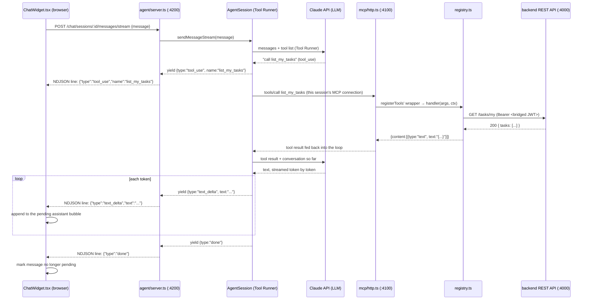
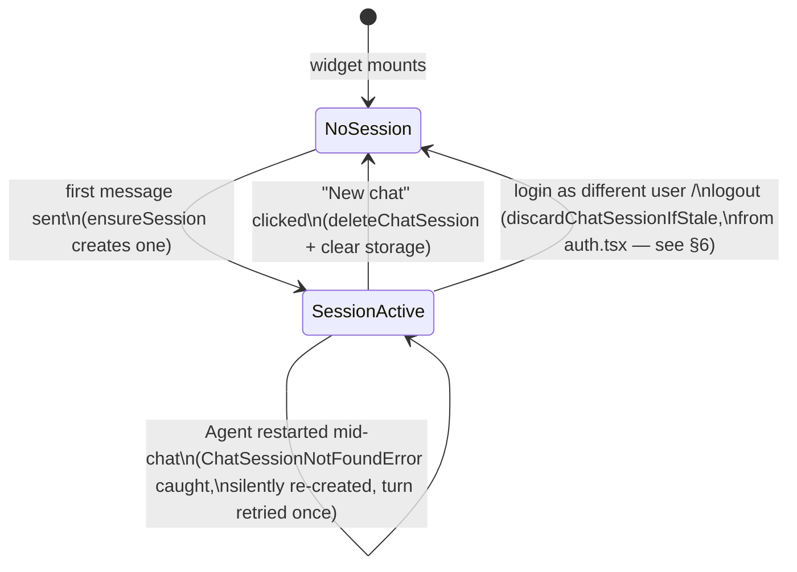

# ChatWidget — Technical Reference

`ChatWidget.tsx` is the floating chat bubble on every page of the dashboard.
This document explains it end to end: what it is, exactly how a typed
message travels through the Agent, the LLM, MCP, and the backend API before
a reply streams back, and — since this came up explicitly — where the
Claude API key lives and why it never reaches your browser. Two
definitions per concept throughout: **Technical**, then **Natural
Language**.

---

## 1. What is ChatWidget?

**Technical:** a self-contained React component (`frontend/src/components/ChatWidget.tsx`,
~240 lines, no external state library) that renders a floating toggle
button plus a chat panel, and talks exclusively to one HTTP surface — the
**Nilex Agent**'s API (`nilex-ai/src/agent/server.ts`, proxied through Vite
as `/agent` → `http://localhost:4200`) via helper functions in
`frontend/src/lib/chatApi.ts`. It never talks to the backend REST API
directly, never talks to MCP directly, and never talks to Claude directly —
all three of those are the Agent's job, several layers downstream.

**Natural Language:** a chat bubble that looks like every other embedded
chat widget, but instead of hitting a canned FAQ or a generic chatbot
backend, it's connected to a real AI agent that can actually look up and
change your tasks — because everything it does eventually flows through the
exact same API and permission checks the dashboard's own buttons use.

---

## 2. Files involved (widest to narrowest)

| File | Role | Runs where |
|---|---|---|
| `frontend/src/components/ChatWidget.tsx` | The UI: button, panel, message list, input, streaming render | Browser |
| `frontend/src/lib/chatApi.ts` | HTTP helpers + session-storage bookkeeping (`createChatSession`, `streamChatMessage`, `discardChatSessionIfStale`, ...) | Browser |
| `frontend/src/lib/auth.tsx` | Calls `discardChatSessionIfStale()` on login/logout so the widget's session tracks the current dashboard user | Browser |
| `nilex-ai/src/agent/server.ts` | HTTP surface: `POST /chat/sessions`, `.../messages/stream`, `DELETE /chat/sessions/:id` | Node (Agent process, port `4200`) |
| `nilex-ai/src/agent/agentSession.ts` | One conversation's state: message history + a live MCP client connection + the Claude API tool-use loop | Node (Agent process) |
| `nilex-ai/src/mcp/http.ts` | The MCP server the Agent connects to as a client (see `nilex-ai/src/mcp/MCPReadMe.md`) | Node (MCP process, port `4100`) |
| `nilex-ai/src/registry.ts` | Where a tool call actually turns into a backend API request | Same process as whichever MCP transport is handling it |
| `backend/src/routes/*.ts` | The REST API everything ultimately lands on | Node (backend process, port `4000`) |

---

## 3. Configuration — and specifically, the Claude API key

**Technical:** `ChatWidget.tsx` and `chatApi.ts` read **zero** environment
variables and hold **no secrets**. The only thing they persist is a random
session ID in `sessionStorage` (browser-local, cleared when the tab
closes). `ANTHROPIC_API_KEY` is read exactly once in the entire codebase —
inside `nilex-ai/src/agent/agentSession.ts`'s `getAnthropicClient()`,
implicitly, by the Anthropic SDK's `new Anthropic()` constructor (it reads
`process.env.ANTHROPIC_API_KEY` on its own; nothing in this project passes
it explicitly) — and that code runs **only** inside the Agent process, on
your machine, server-side.

**Natural Language:** your browser never sees the Claude API key, full
stop. The chain of trust is: you → your backend's JWT → the Agent (which
holds the *real* secret) → Anthropic. If you opened your browser's dev
tools and inspected every network request the chat widget makes, you would
not find the API key anywhere in them — it never leaves the Agent process.

### Where each setting actually lives

| Setting | File | Read by | Notes |
|---|---|---|---|
| `ANTHROPIC_API_KEY` | `nilex-ai/.env` | `agentSession.ts` (via the SDK) | The one genuinely required secret for chat to work at all |
| `NILEX_MCP_URL` | `nilex-ai/.env` | `agentSession.ts` | Where the Agent's MCP client connects — default `http://localhost:4100/mcp` |
| `NILEX_AGENT_PORT` | `nilex-ai/.env` | `agent/server.ts` | What port the Agent's own HTTP API listens on — default `4200` |
| `TOOL_SYNC_KEY` | `nilex-ai/.env` (must match `backend/.env`) | `mcp/http.ts` (indirectly, via `syncCatalog()`) | Not chat-specific — every MCP process needs this, chat or not |
| `/agent` proxy | `frontend/vite.config.ts` | Vite dev server | Rewrites `/agent/*` → `http://localhost:4200/*` so the browser only ever talks to one origin (`localhost:5173`), avoiding CORS entirely in dev |
| *(nothing)* | `frontend/` | — | No `.env` file, no API key, no chat-specific config at all on this side |

**What has to be running, in order, for the chat widget to work:**

```sh
# 1. Postgres
docker compose up -d postgres

# 2. Backend
cd backend && npm run dev              # :4000

# 3. Frontend
cd frontend && npm run dev             # :5173

# 4. MCP server (needs backend up, for its startup catalog sync)
cd nilex-ai && npm run mcp:http        # :4100

# 5. Agent (needs MCP server up, and ANTHROPIC_API_KEY set in nilex-ai/.env)
cd nilex-ai && npm run agent:server    # :4200
```

If step 5's env var is missing, session creation still succeeds (the Agent
doesn't validate the key eagerly) but the *first* message will fail with an
authentication error from Anthropic's API — surfaced in the chat as a red
error bubble (`isError: true`, see §7), not a crash.

---

## 4. The full call chain: MCP → LLM → AI Agent → API

**Technical:** one outgoing chat message crosses five process boundaries.
**Natural Language:** think of it as a relay race — your message gets
handed off five times before a real database query happens, and the answer
gets handed back the same five times in reverse.



Mapped onto your four terms explicitly:

- **AI Agent** = `AgentSession` — owns the conversation's message history
  and drives the Claude API's Tool Runner loop (ask → tool call requested →
  run it → send result back → repeat, capped at 10 iterations).
- **LLM** = Claude (`claude-opus-4-8`), reached via `client.beta.messages.toolRunner(...)`
  inside `AgentSession` — the thing actually deciding *whether* and *which*
  tool to call, and writing the final natural-language reply.
- **MCP** = the connection `AgentSession` opens, as an MCP *client*, to
  `mcp/http.ts` (an MCP *server*) — this is *how* a decided tool call
  actually gets executed, rather than the LLM doing it itself.
- **API call** = what a registry tool's handler does once MCP hands it
  control — an authenticated `fetch()` against `backend/src/routes/*.ts`,
  the same REST API the dashboard's own buttons call.

---

## 5. Session lifecycle inside the widget

**Technical:** `ChatWidget` tracks one MCP-Agent conversation via
`sessionIdRef` (a `useRef`, not state — it doesn't need to trigger
re-renders) plus `sessionStorage`. `ensureSession()` is the single
choke point: if a session ID is already known, reuse it; otherwise call
`createChatSession()`, which sends the dashboard's JWT and gets back a
`sessionId` already bridged to your identity (see §6).

**Natural Language:** the widget doesn't create a new conversation every
time you send a message — it creates one the *first* time, then keeps
reusing it (even across page navigations, since it's in `sessionStorage`,
not component state) until you explicitly start a new chat or your login
identity changes.



**Three things can end a session**, and the widget treats them differently:

1. **"New chat" button** (`handleNewChat`) — explicit, user-initiated.
   Deletes the Agent-side session, clears local storage, clears the visible
   message list.
2. **Login/logout identity change** — handled *outside* this component
   entirely, in `frontend/src/lib/auth.tsx`'s `login()`/`logout()`, via
   `discardChatSessionIfStale()`. By the time `ChatWidget` (re)mounts after
   an identity change, any stale session is already gone — the widget
   itself doesn't need to know this happened.
3. **The Agent process restarted** (sessions are in-memory only — see
   `MCPReadMe.md`'s equivalent note for the MCP HTTP transport) — caught as
   `ChatSessionNotFoundError` inside `send()`'s retry loop: clear the dead
   session ID, silently create a fresh one, retry the *same* turn once.
   You never see an error for this specific case — the reply just takes
   marginally longer.

---

## 6. Auth bridging — why you're never asked to log in

**Technical:** `createChatSession()` sends `Authorization: Bearer <token>`
(read from `localStorage` via `getToken()`) on the *session-creation*
request. The Agent's `POST /chat/sessions` handler sees that header and
calls `session.authenticateWithToken(token)` — which calls the
`login_with_token` MCP tool **directly**, bypassing Claude's reasoning
entirely (there's no decision for the LLM to make: you're already who you
are). Once bridged this way, `AgentSession` additionally removes `login`
and `logout` from what the LLM can call for that session (see
`nilex-ai/README.md`'s Phase 4 section for exactly why that matters) — so
it's structurally impossible for the widget to end up asking you for
credentials.

**Natural Language:** the widget quietly hands over your existing dashboard
login the moment you open the chat — you never see this happen, but it's
why typing a question works immediately instead of starting with "please
log in."

---

## 7. Streaming — reading the reply as it's written

**Technical:** `streamChatMessage()` (`chatApi.ts`) reads the response body
as an NDJSON stream — one JSON object per line, **not** formal
Server-Sent-Events (the browser's `EventSource` API can't POST a body or
set an `Authorization` header, so the frontend has to hand-parse the stream
either way; NDJSON needs less framing than SSE for the same result). It
buffers partial lines that land split across chunk boundaries
(`buffer = lines.pop() ?? ""`) before yielding each complete line as a
parsed `AgentStreamEvent`.

**Natural Language:** instead of waiting for Claude's entire reply and
showing it all at once, the widget shows it typing itself out, word by
word, and shows a small "using `list_my_tasks`..." indicator the *instant*
Claude decides to look something up — before that lookup has even finished
— so the UI never sits there looking frozen.

`ChatWidget.applyEvent()` maps each event type to a UI update:

| Event | UI effect |
|---|---|
| `tool_use` | Shows the "using `{name}`..." indicator (with a pulsing icon) |
| `text_delta` | Appends `text` to the pending assistant bubble; clears the tool indicator |
| `done` | Marks that message as no longer pending (stops showing "...") |
| `error` | Replaces the bubble's text with the error message, styled red (`isError: true`) |

Assistant replies render through `react-markdown` (bold, bullet lists),
never `dangerouslySetInnerHTML` — so there's no XSS surface from rendering
LLM-generated text, even though that text is fundamentally "content from
the internet" in a security sense.

---

## 8. The open/close animation

**Technical:** the chat panel is **always mounted** — `open` toggles
Tailwind transform/opacity classes (`translate-y-6 scale-95 opacity-0` ↔
`translate-y-0 scale-100 opacity-100`, `transition-all duration-300`)
rather than the element being conditionally rendered. `pointer-events-none`
and `aria-hidden={!open}` keep it inert (unclickable, invisible to screen
readers) while closed, without unmounting — which is what makes the
animation possible at all (React can't transition something in or out of
existence, only its own CSS properties) and also preserves scroll position
and any in-flight state across opens/closes.

**Natural Language:** the panel doesn't just pop into existence — it grows
up out of the launcher button with a short slide-and-fade, and does the
same in reverse when you close it.

---

## 9. Error handling

**Technical:** every failure surfaces as a red assistant bubble
(`isError: true`) rather than a thrown exception reaching React — `send()`'s
outer `try/catch` catches anything `ensureSession()` or
`streamChatMessage()` throws and writes `err.message` directly into the
pending message. Session-creation failures (e.g. the Agent isn't running)
surface the same way, since `ensureSession()` runs inside the same `try`.

**Natural Language:** if something's down — the Agent isn't running, the
Anthropic API key is missing, the network hiccups — you see a plain-English
error message in the chat itself, in red, instead of the widget silently
doing nothing or the page crashing.

---

## 10. Related docs

- **`nilex-ai/README.md`** (Phase 4 section) — the Agent's HTTP API in
  full, with `curl` examples for every endpoint this widget calls
- **`nilex-ai/src/mcp/MCPReadMe.md`** — what happens on the other side of
  the MCP connection `AgentSession` opens
- **`nilex-ai/src/cli/CLIReadMe.md`** — the CLI's very different path to
  the same registry (no MCP, no LLM, direct function calls)
- **`NilesxAIOverView.md`** — the same "one action, several front doors"
  idea as §4 above, but comparing all four front doors side by side rather
  than going deep on just this one
