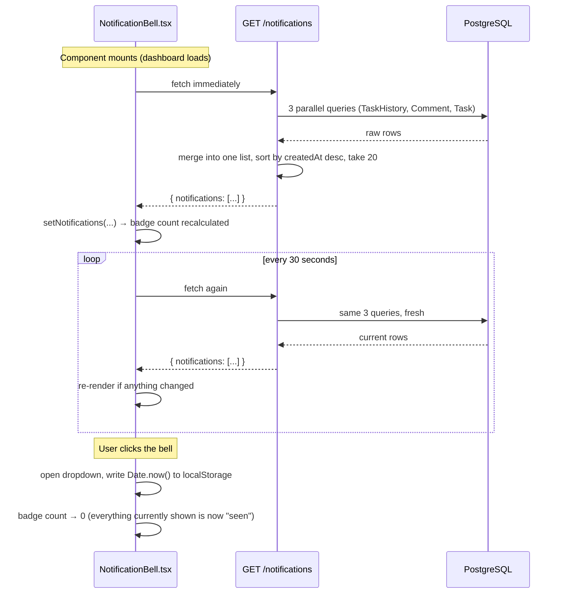

# NotificationBell — Technical Reference

The bell icon in the dashboard header, polling every 30 seconds for
anything relevant to you. This document covers where the data actually
comes from (there's no notifications table — that's the most important
thing to understand about this feature), the fetch/poll cycle, and exactly
how read/unread and display work. Two definitions per concept: **Technical**,
then **Natural Language**.

---

## 1. What is it?

**Technical:** a self-contained React component
(`frontend/src/components/NotificationBell.tsx`) that polls
`GET /notifications` every 30 seconds and renders the results in a
dropdown, with an unread-count badge computed client-side against a
`localStorage`-persisted "last seen" timestamp. It holds its own state —
nothing about it is wired through `auth.tsx` or any global store.

**Natural Language:** a bell icon that quietly checks "did anything happen
to my tasks?" twice a minute, and shows a small red count if there's
something you haven't looked at yet — the same idea as a notification bell
on any social app, just for your task list.

---

## 2. Files involved

| File | Role |
|---|---|
| `frontend/src/components/NotificationBell.tsx` | Polling, unread-count logic, the dropdown UI |
| `frontend/src/components/layout/Header.tsx` | Mounts `<NotificationBell />` once, between the theme toggle and the user menu |
| `frontend/src/lib/api.ts` | `listNotifications()` + the `NotificationEntry` type — the thin HTTP client |
| `backend/src/routes/notifications.ts` | **Where the actual logic lives** — turns three existing tables into a notification feed on every request |

---

## 3. The database store — or rather, the deliberate lack of one

**Technical:** there is **no `Notification` table** in
`backend/prisma/schema.prisma`. `GET /notifications` computes the feed
fresh on every single call, by querying three tables that already exist for
other reasons and already existed before this feature was built:

| Source table | Query | What it contributes |
|---|---|---|
| `TaskHistory` | entries where `actorId != you`, on a task you currently own (assignee or creator) | "Someone else started/completed/assigned/updated a task of yours" |
| `Comment` | entries where `authorId != you`, on a task you currently own | "Someone commented on your task" |
| `Task` | tasks you own, not `COMPLETED`, with `dueDate` within the next 24h or already past | Synthesized overdue / due-soon reminders — these have no "actor," they're derived from *current state*, not a past event |

**Natural Language:** instead of a separate "notifications" list that has
to be kept in sync with everything else (and could drift out of date, or
need its own cleanup job), the feature just *looks at* your tasks' real
history, comments, and due dates every time you check, and figures out
what's newsworthy on the spot. There's nothing to go stale, because nothing
is stored — it's recomputed fresh, every 30 seconds.

**Why this matters in practice:** reassign a task away from someone, and
they immediately stop seeing its *future* history in their feed — not
because anything was deleted, but because the query's `OR: [{assigneeId},
{createdById}]` condition no longer matches them. That's intentional, not a
bug: it's no longer "their" task.

**The one piece of state that *is* stored:** which notifications you've
"seen." That's not server-side at all — it's a single ISO timestamp in the
browser's `localStorage` (`nilex.notifications.lastSeen`), written the
moment you open the dropdown. See §6.

---

## 4. Fetch / polling mechanism

**Technical:**

```ts
const POLL_INTERVAL_MS = 30_000;

useEffect(() => {
  let cancelled = false;

  async function poll() {
    try {
      const res = await api.listNotifications();
      if (!cancelled) setNotifications(res.notifications);
    } catch {
      // ignore transient polling errors
    }
  }

  poll();                                          // fetch immediately on mount
  pollRef.current = setInterval(poll, POLL_INTERVAL_MS);
  return () => {
    cancelled = true;
    if (pollRef.current) clearInterval(pollRef.current);
  };
}, []);
```

**Natural Language:** the moment the bell appears on screen, it fetches
right away (so you're not staring at an empty state for 30 seconds), then
keeps re-fetching every 30 seconds for as long as the dashboard is open. If
a fetch fails — network hiccup, backend briefly down — it's silently
ignored; the next poll 30 seconds later just tries again. Closing the page
(or navigating away in a way that unmounts the component) stops the
polling cleanly — no orphaned timers left running.

**Why the `cancelled` flag:** if the component unmounts *while* a fetch is
still in flight (you closed the tab a split second after a poll fired), the
`.then` callback would otherwise try to call `setNotifications` on an
unmounted component. The `cancelled` boolean, closed over by the `poll()`
function, is checked right before that `setState` call to prevent it — a
standard React data-fetching guard, not anything notification-specific.

---

## 5. The end-to-end run/display workflow



**Backend side, per request** (`backend/src/routes/notifications.ts`):

1. Run the three queries in §3 **concurrently** (`Promise.all`), each
   capped/filtered appropriately (`take: 20` on history/comments; the
   due-date query has no explicit cap since it's naturally bounded to your
   own non-completed tasks).
2. Map each source into a common shape:
   `{id, taskId, taskTitle, actorName, action, description, createdAt}`.
   Note the `id` prefix — `history:<id>`, `comment:<id>`,
   `overdue:<taskId>`, `duesoon:<taskId>` — so entries from different
   sources can never collide as React list keys even though they come from
   different tables with their own independent ID sequences.
3. **Merge and sort** all three lists together by `createdAt` descending,
   then slice to the 20 most recent overall — so a very chatty task with
   many comments doesn't starve out a genuinely urgent due-date reminder
   from a different task; they compete on recency, not on which table they
   came from.
4. Send `{ notifications: [...] }`.

---

## 6. Read / unread — entirely client-side

**Technical:**

```ts
const [lastSeen, setLastSeen] = useState<string>(
  () => localStorage.getItem(LAST_SEEN_KEY) ?? "",
);

const unreadCount = notifications.filter(
  (n) => !lastSeen || n.createdAt > lastSeen,
).length;

function handleToggle() {
  setOpen((o) => !o);
  if (!open) {
    const now = new Date().toISOString();
    localStorage.setItem(LAST_SEEN_KEY, now);
    setLastSeen(now);
  }
}
```

**Natural Language:** the backend has no concept of "read" at all — it just
hands back the 20 most recent relevant things, every time, full stop.
"Unread" is purely a browser-side comparison: *is this entry newer than the
last time I opened the bell?* The instant you click the bell open, "now" is
saved as your new bookmark, so the red count clears — even for entries
still sitting in the list below.

**Consequence worth knowing:** `localStorage` is per-browser, not
per-account server-side. Log in as the same user on a different browser or
device, and your "last seen" bookmark doesn't follow you — you'll see
everything from the last 20 entries marked unread there, independent of
what you'd already dismissed elsewhere.

### The overdue/due-soon timestamp trick

**Technical:** history and comment entries have a real, one-time
`createdAt` — the moment that history row or comment was actually written.
Overdue/due-soon entries have no such moment (a task doesn't "happen" to
become overdue, it's a continuously-true fact about the current time vs. its
`dueDate`) — so the backend assigns them a **synthetic but stable**
timestamp instead: `dueDate` itself for "overdue," or `dueDate - 24h` for
"due soon."

**Natural Language:** without this, an overdue task would look
*brand new* on literally every single poll (since "now" always changes),
permanently stuck as unread no matter how many times you opened the bell.
Anchoring it to a fixed point — the moment it crossed into overdue, or the
moment the 24-hour warning window opened — means it behaves exactly like a
real event for read/unread purposes: open the bell once after that moment,
and it's marked seen, same as anything else.

---

## 7. Display

**Technical:** `notifications.map(...)` renders each entry's
`description` (a pre-formatted, human-readable string built entirely
server-side — the frontend does no string assembly) and a relative
timestamp via a local `timeAgo()` helper (`"just now"` / `"Nm ago"` /
`"Nh ago"` / `"Nd ago"`, no library). The dropdown itself
(`max-h-80 overflow-y-auto`) caps its own height independently of the
button that opens it, closes on an outside click via a full-viewport
transparent overlay (`<div className="fixed inset-0 z-10" onClick={...} />`
— the same pattern the header's user-menu dropdown uses), and shows a
"No notifications yet" empty state when the list is empty.

**Natural Language:** each row is one plain sentence — *"Sam Member
completed 'Fix login bug'"*, *"'Draft Q3 board deck' is overdue (was due
Jul 20)"* — plus how long ago it happened, newest first, capped at 20 so
the list never grows unbounded. Click anywhere outside the dropdown and it
closes, same as the account menu next to it.

**The badge itself:** a small red circle, top-right of the bell icon, only
rendered when `unreadCount > 0`; shows the exact count up to 9, then `9+`
beyond that.

---

## 8. Configuration

**Technical:** every "setting" here is a hardcoded constant, not an
environment variable — there's nothing to configure via `.env` for this
feature.

| Constant | File | Value | What changing it would do |
|---|---|---|---|
| `POLL_INTERVAL_MS` | `NotificationBell.tsx` | `30_000` (30s) | How often the frontend re-fetches |
| `LAST_SEEN_KEY` | `NotificationBell.tsx` | `"nilex.notifications.lastSeen"` | The `localStorage` key name — bumping it would reset everyone's read/unread state once |
| `take: 20` (×2) | `backend/src/routes/notifications.ts` | `20` | Max history/comment rows considered *before* merging — also the final slice size |
| `DUE_SOON_WINDOW_MS` | `backend/src/routes/notifications.ts` | `24 * 60 * 60 * 1000` (24h) | How far ahead of a due date the "due soon" reminder starts appearing |

---

## 9. Related docs

- **`NILEXAIReadMe.md`** §8 — where notifications fit into the wider
  dashboard feature tour
- **`README.md`** — the `GET /notifications` endpoint listed in the API
  surface changelog (Phase 5/6 sections)
- **http://localhost:4000/docs** — try `GET /notifications` yourself,
  interactively, with a real JWT
