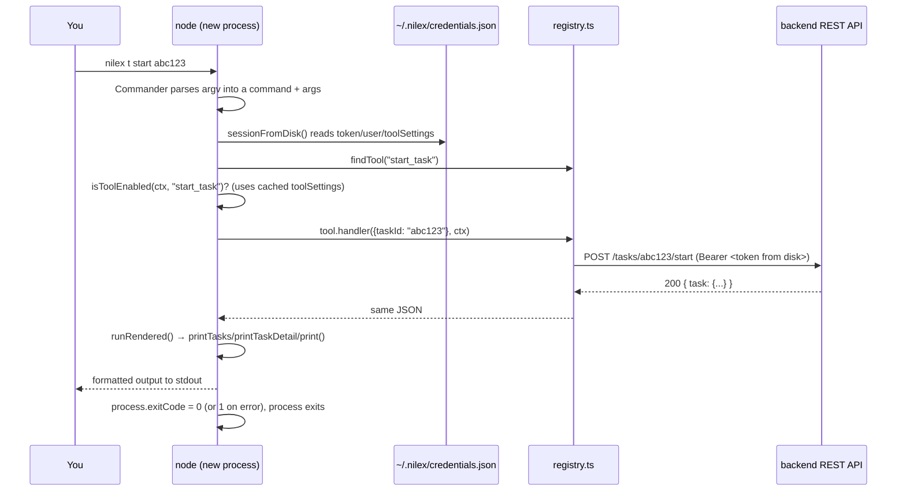
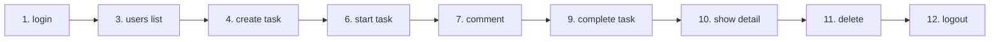

# CLI Folder — Technical Reference

This folder (`nilex-ai/src/cli/`) is the `nilex` terminal command — the
third front door onto the shared tool registry, alongside the MCP server
(`nilex-ai/src/mcp/`, see `MCPReadMe.md`) and the AI Agent. Every section
below gives you **two definitions** — Technical, then Natural Language — so
this doc works whether you're extending the code or just trying to
understand what a command actually does.

---

## 1. What is the CLI?

**Technical:** a [Commander.js](https://github.com/tj/commander.js)
program (`src/cli/index.ts`) that, for each subcommand, looks up a matching
entry by name in `../registry.ts` and invokes its `handler(args, ctx)`
directly, in-process — no MCP protocol, no network hop to an MCP server, no
subprocess spawning. It is the *thinnest* of the three front doors: no
protocol translation layer at all, just argument parsing → function call →
print result.

**Natural Language:** a terminal command that does the exact same things
the dashboard buttons do, typed instead of clicked — `nilex t start abc123`
starts a task the same way clicking "Start" on the kanban board does,
because underneath, they both end up calling the same backend API endpoint.

---

## 2. Files in this folder

| File | Role |
|---|---|
| `index.ts` | The program itself — defines every command/subcommand/flag and wires each to a registry tool |
| `credentials.ts` | Reads/writes `~/.nilex/credentials.json` — the CLI's persisted login |
| `prompt.ts` | Terminal input helpers: plain prompts, masked password entry, piped-stdin handling |
| `colors.ts` | Hand-rolled ANSI color helpers (no dependency) — priority/status color mapping |
| `render.ts` | Custom table/detail formatters for tasks, task detail, and comments (color-coded, aligned) |

---

## 3. Configuration & settings

**Technical:** the CLI reads exactly one environment variable
(`NILEX_API_URL`, defaulting to `http://localhost:4000`, read lazily inside
`../lib/backendClient.ts`'s `getApiUrl()` — not cached at module load, so it
always reflects whatever `.env` was loaded at process start) and persists
one file (`~/.nilex/credentials.json`) between invocations. It does *not*
read `TOOL_SYNC_KEY` or `ANTHROPIC_API_KEY` — those belong to the MCP
server and the Agent respectively, not the CLI.

**Natural Language:** there's almost nothing to configure. If your backend
runs on the default `localhost:4000`, you don't need a `.env` file for the
CLI at all — it just works. The one thing it remembers between commands is
who you're logged in as, saved to a file in your home folder.

| Setting | Where | Required? | Default |
|---|---|---|---|
| `NILEX_API_URL` | `nilex-ai/.env` | No | `http://localhost:4000` |
| `~/.nilex/credentials.json` | Written by `nilex login`, read by every other command | Created automatically | — |
| `NO_COLOR` | Any env var with this name set (to anything) | No | Colors on, if stdout is a TTY |

**Credentials file shape** (`credentials.ts`):

```jsonc
// ~/.nilex/credentials.json
{
  "token": "<JWT from POST /auth/login>",
  "user": { "id": "...", "email": "...", "name": "...", "role": "ADMIN" },
  "toolSettings": { "delete_user": false, "...": true }
}
```

`toolSettings` is a snapshot of which tools are enabled, fetched once at
login (`refreshToolSettings()`) — an ADMIN disabling a tool afterward takes
effect on your *next* `nilex login`, not instantly. This is a deliberate
tradeoff (documented in `nilex-ai/README.md`'s "Admin panel integration"
section) that avoids every single command paying a network round trip just
to check one flag.

---

## 4. The lifecycle of one CLI command

**Technical:** each `nilex ...` invocation is a **fresh OS process** — there
is no long-running daemon. Contrast this with the MCP server (one process
serves many tool calls across a session's lifetime — see `MCPReadMe.md`
§"stdio.ts" / §"http.ts"). Because of that, session state can't live in
memory between commands; it has to round-trip through disk.

**Natural Language:** every time you type `nilex ...` and hit Enter, it's a
brand-new program starting from scratch — it has amnesia about anything
from the last command, except what it deliberately wrote to that
credentials file.



Every non-trivial command follows this exact shape via one of two internal
runners in `index.ts`:

- **`run(name, args)`** — the general case: call the tool, print the raw
  result via `print()` (a `console.table` for arrays, pretty-printed JSON
  otherwise).
- **`runRendered(name, args, render)`** — used for anything task-shaped, so
  output goes through the color-coded formatters in `render.ts`
  (`printTasks`, `printTaskDetail`, `printComments`) instead of raw JSON.

Both share identical auth/enabled-check logic — they're kept as two
functions specifically so task output can look like a real table instead of
a JSON dump, without duplicating the session-loading/error-handling logic
twice by hand.

---

## 5. "Session," CLI-style

**Technical:** there is no `SessionContext` held in memory across commands
the way there is for one MCP connection. `sessionFromDisk()` constructs a
*brand-new* `SessionContext` object on every invocation, populated from
whatever `credentials.ts` last wrote:

```ts
function sessionFromDisk(): SessionContext {
  const creds = loadCredentials();
  return {
    token: creds?.token ?? null,
    user: creds?.user ?? null,
    clientLabel: "cli",
    toolSettings: creds?.toolSettings ?? null,
  };
}
```

**Natural Language:** it *feels* like being logged in continuously, the
same way staying logged into a website across browser tabs feels
continuous — but really, every single command quietly re-reads your saved
login token from a file, uses it once, and forgets it again the moment the
command finishes.

`clientLabel: "cli"` is what makes the backend's Activity Log show `cli` as
the origin for anything done this way, distinct from `web`, `mcp-stdio`, or
`mcp-http` — every front door tags its own requests.

---

## 6. Ordered walkthrough: the full task lifecycle via CLI

This is the same sequence you'd click through in the dashboard, run
end-to-end from a terminal. Each step names the **CLI command**, the
**registry tool** it calls, and the **backend endpoint** that ultimately
gets hit — three names for the same action, which is the whole point of the
shared registry (see `NilesxAIOverView.md` §3 if that connection isn't
obvious yet).

| # | Command | Registry tool | Backend endpoint | Notes |
|---|---|---|---|---|
| 1 | `nilex login` | `login` | `POST /auth/login` | Prompts for email/password, writes `~/.nilex/credentials.json` |
| 2 | `nilex whoami` | `whoami` | *(none)* | Reads the cached session only — no network call at all |
| 3 | `nilex u ls` | `list_users` | `GET /users` | ADMIN/MANAGER only — need a user ID to assign step 4 to |
| 4 | `nilex t new -t "Fix login bug" -p high -a <userId>` | `create_task` | `POST /tasks` | ADMIN/MANAGER only |
| 5 | `nilex t lm` | `list_my_tasks` | `GET /tasks/my` | Confirms the task landed where expected |
| 6 | `nilex t start <taskId>` | `start_task` | `POST /tasks/:id/start` | TODO → IN_PROGRESS; stamps `startedAt` |
| 7 | `nilex t comment <taskId> "Repro'd, working on a fix"` | `add_comment` | `POST /tasks/:id/comments` | |
| 8 | `nilex t comments <taskId>` | `list_comments` | `GET /tasks/:id/comments` | |
| 9 | `nilex t complete <taskId>` | `complete_task` | `POST /tasks/:id/complete` | IN_PROGRESS → COMPLETED; stamps `completedAt` |
| 10 | `nilex t show <taskId>` | `get_task` | `GET /tasks/:id` | Full detail: priority, due date, timestamps, time taken |
| 11 | `nilex t rm <taskId>` | `delete_task` | `DELETE /tasks/:id` | ADMIN/MANAGER only |
| 12 | `nilex logout` | *(local only)* | *(none)* | Deletes `~/.nilex/credentials.json`; no request sent |



### Running it for real

```sh
$ nilex login
Email: admin@example.com
Password: ********
Logged in as Alice Admin (ADMIN)

$ nilex whoami
{
  "loggedIn": true,
  "user": { "id": "cmro2s...", "email": "admin@example.com", "name": "Alice Admin", "role": "ADMIN" }
}

$ nilex u ls
┌─────────┬────────────────┬───────────────────────────┬────────┐
│ (index) │      id        │            email           │  role  │
├─────────┼────────────────┼───────────────────────────┼────────┤
│    0    │ 'cmro2srdf...'  │ 'member@example.com'       │ 'MEMBER'│
└─────────┴────────────────┴───────────────────────────┴────────┘

$ nilex t new -t "Fix login bug" -p high -a cmro2srdf0008znpwuaa2dq0s --due 2026-08-01
{
  "task": { "id": "cmrpij06l...", "title": "Fix login bug", "priority": "HIGH", "status": "TODO", ... }
}

$ nilex t start cmrpij06l...
{ "task": { "id": "cmrpij06l...", "status": "IN_PROGRESS", "startedAt": "2026-07-..." } }

$ nilex t comment cmrpij06l... "Repro'd, working on a fix"
{ "comment": { "body": "Repro'd, working on a fix", "author": { "name": "Alice Admin" }, ... } }

$ nilex t complete cmrpij06l...
{ "task": { "id": "cmrpij06l...", "status": "COMPLETED", "completedAt": "2026-07-..." } }

$ nilex t show cmrpij06l...
Fix login bug
cmrpij06l...

Status:      COMPLETED
Priority:    HIGH
Assignee:    Sam Member
Created by:  Alice Admin
Due:         Aug 1 2026
Started:     7/20/2026, 9:12:00 am
Completed:   7/20/2026, 9:14:30 am
Time taken:  2m

$ nilex logout
Logged out.
```

---

## 7. Errors & exit codes

**Technical:** both `run()` and `runRendered()` share the same failure
shape — a thrown error's `.message` is printed via `console.error()`
(stderr, not stdout) and `process.exitCode` is set to `1`. Three distinct
failure points map to three different messages:

| Failure | Message | Cause |
|---|---|---|
| Unknown tool name | `Unknown tool: <name>` | Shouldn't happen via the CLI's own commands — only reachable if `index.ts` and `registry.ts` drift apart |
| Tool disabled | `The '<name>' tool has been disabled by an administrator.` | `isToolEnabled()` returned false against the cached `toolSettings` |
| Handler threw | The thrown error's own `.message` | Usually the backend's own error response text — e.g. `"Validation error"`, `"You do not have access to this task"`, a 403/404's message, forwarded verbatim from `apiRequest()` |

**Natural Language:** if a command fails, you'll see a plain error line
instead of a stack trace, and the program will exit with a non-zero status
— so `nilex t start abc123 && echo "started!"` only prints `started!` if it
actually worked, which matters if you're scripting around the CLI.

---

## 8. Color output

**Technical:** `colors.ts` exports a tiny ANSI wrapper (`color.red`,
`.amber`, `.green`, `.slate`, `.bold`, `.dim`) plus two semantic helpers,
`priorityColor()` and `statusColor()`, used throughout `render.ts`. Colors
are computed once at module load (`const enabled = Boolean(process.stdout.isTTY) && !process.env.NO_COLOR`)
— no per-call check, and no dependency (`chalk` or similar) was added.

**Natural Language:** task tables are color-coded the same way the
dashboard is — red for High priority or overdue, amber for Medium priority
or In Progress, green for Completed, muted gray for Low priority or To Do —
but only when you're actually looking at a terminal. Pipe the output to a
file or another program (`nilex t la > tasks.txt`) and the colors
automatically turn themselves off, so the file doesn't fill up with escape
codes.

---

## 9. Short forms & discoverability

**Technical:** every command group has a Commander `.alias()`
(`tasks`→`t`, `users`→`u`, `roles`→`r`), and several subcommands do too
(`list-all`→`la`, `list-my`→`lm`, `create`→`new`, `complete`→`done`,
`delete`→`rm`). `nilex --help` and `nilex tasks --help` are generated
directly from these definitions, so they can never drift out of sync with
what the commands actually accept.

**Natural Language:** once you know the pattern, most things you'd type
compress down — `nilex tasks list-all --status TODO` and `nilex t la -s
TODO` run the identical command. The full flag-by-flag reference (required
vs. optional, worked examples for every command) lives in
`nilex-ai/README.md`'s "Using the CLI" section — this document explains
*how* the CLI works; that one is the complete command dictionary.

---

## 10. Related docs

- **`nilex-ai/README.md`** — full CLI command reference (every flag,
  required vs. optional, more worked examples)
- **`nilex-ai/src/mcp/MCPReadMe.md`** — the MCP server this folder does
  *not* use, for contrast, and the protocol-level detail behind Claude
  Desktop/Code's version of these same operations
- **`NilesxAIOverView.md`** — how the CLI, MCP, Agent, and dashboard chatbot
  all relate conceptually, including the same task-lifecycle example traced
  through all four front doors
- **`NILEXAIReadMe.md`** — whole-project setup and tour
