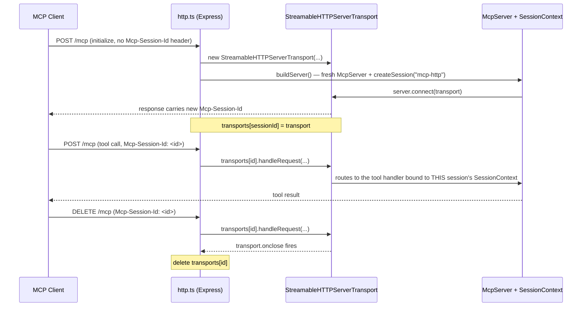

# MCP Folder — Technical Reference

This folder (`nilex-ai/src/mcp/`) is where Nilex AI's tool registry becomes an
actual [MCP](https://modelcontextprotocol.io) server — the thing Claude
Desktop, Claude Code, and the Nilex Agent connect to. It knows nothing about
tasks, users, or roles; it only knows how to speak the MCP protocol and hand
off every tool call to `../registry.ts`. This document covers this folder
specifically — for the wider system (backend API, CLI, Agent, dashboard chat
widget), see `nilex-ai/README.md` and the top-level `README.md`.

## Files in this folder

| File | Role | Ships in the product? |
|---|---|---|
| `stdio.ts` | MCP server over stdin/stdout — one process per client (Claude Desktop, Claude Code) | Yes |
| `http.ts` | MCP server over Streamable HTTP — one process, many concurrent client sessions (the Agent, Phase 4's chat widget) | Yes |
| `registerTools.ts` | Adapts `registry.ts` entries into MCP SDK tools; the only file that knows both "registry" and "MCP" | Yes |
| `testStdioClient.ts` | Scripted smoke test: spawns `stdio.ts` as a real subprocess, exercises several tools | No — dev-only |
| `testHttpClient.ts` | Scripted smoke test: connects to a running `http.ts`, exercises login + a tool call | No — dev-only |
| `testDisabledTool.ts` | Scripted smoke test: proves a tool disabled in the Admin panel is refused client-side | No — dev-only |

## Where this sits in the bigger picture

```
                         ../registry.ts
              (name, description, zod input schema, handler —
               zero knowledge of MCP, stdio, or HTTP)
                              │
                              ▼
                     registerTools.ts
        (wraps each registry entry as an MCP SDK tool,
         bound to ONE session's SessionContext)
                              │
                ┌─────────────┴─────────────┐
                ▼                            ▼
            stdio.ts                      http.ts
      (StdioServerTransport)      (StreamableHTTPServerTransport,
                                    one per session, keyed by session ID)
                │                            │
                ▼                            ▼
      Claude Desktop / Claude Code      Nilex Agent (../agent/agentSession.ts),
      (spawns this as a subprocess)     any other network MCP client
```

Both `stdio.ts` and `http.ts` do the exact same three things at startup:

1. `loadEnv()` — load `nilex-ai/.env` (see `../lib/loadEnv.ts`'s doc comment
   for why this is resolved from the file's own location, not `cwd`).
2. `syncCatalog()` — push this process's tool list to the backend
   (`POST /tool-settings/sync`, shared-secret auth) so the Admin panel's Tool
   Registry page mirrors what's actually running. Best-effort: a down backend
   doesn't stop the MCP server from serving tools, it just means the Admin
   panel is stale until the next successful sync.
3. Build an `McpServer`, call `registerTools(server, session)`, connect a
   transport.

The only structural difference is **what happens after that** — stdio gets
one `SessionContext` for the lifetime of the process; HTTP gets a fresh one
per client session, tracked in an in-memory map.

## MCP protocol primer (the pieces this folder touches)

- **Tool** — a named function with a description (read by the LLM to decide
  *when* to call it) and a JSON-Schema-shaped input (so the LLM knows *what
  arguments* to pass). `registerTools.ts` is what turns each `registry.ts`
  entry into one of these.
- **Transport** — how the client and server exchange JSON-RPC messages.
  This folder implements two: **stdio** (`stdio.ts`) and **Streamable HTTP**
  (`http.ts`). Same protocol, different pipe.
- **Session** — one connected client's state. In MCP-the-protocol, a
  Streamable HTTP session is identified by an `Mcp-Session-Id` header,
  established during an `initialize` handshake. In this codebase, `Session`
  also means `SessionContext` (`../lib/session.ts`) — a small object holding
  `{token, user, clientLabel, toolSettings}` — which is what actually gets
  the JWT once the `login` tool runs.
- **Content / isError** — a tool result isn't a raw value; it's
  `{content: [{type: "text", text: "..."}], isError?: boolean}`. See
  `registerTools.ts` below for exactly how registry results get wrapped into
  this shape.

## `stdio.ts` — one process, one session

```ts
loadEnv();
await syncCatalog();

const server = new McpServer({ name: "nilex-ai", version: "0.1.0" });
const session = createSession("mcp-stdio");
registerTools(server, session);

const transport = new StdioServerTransport();
await server.connect(transport);
```

This is how Claude Desktop and Claude Code launch MCP servers: as a local
**subprocess**, talking newline-delimited JSON-RPC over stdin/stdout. The
process itself *is* the session boundary — there's exactly one
`SessionContext`, created once at the top, closed over by every tool handler
for the rest of the process's life. A new conversation in Claude Desktop
spawns a brand-new process, so it starts unauthenticated again — that's why a
fresh chat has to say "log me in as..." before anything else will work.

**Critical constraint: stdout is reserved for JSON-RPC.** Any stray
`console.log()` in this process (or anything it imports) would inject
non-protocol bytes into the stream and corrupt it from the client's point of
view. That's why `syncCatalog()` and every diagnostic log in this folder use
`console.error()` (stderr) exclusively — stderr is unstructured and safe to
write to; stdout is not.

**Launching it directly** (bypassing `npm run mcp:stdio`):

```sh
node dist/mcp/stdio.js
```

This is exactly what Claude Desktop's config does
(`nilex-ai/README.md`'s "Using it with Claude Desktop" section) — `node` +
absolute path, not the `nilex` command, because a GUI-launched process
doesn't reliably inherit your shell's `PATH`. Claude Code, which inherits
your terminal's environment, can use `nilex mcp` instead (see
`src/cli/index.ts`'s `mcp` subcommand — it's a thin dynamic-`import()` of
this same file).

## `http.ts` — one process, many sessions

Unlike stdio, many clients need to talk to this server concurrently (the
Nilex Agent, Phase 4's dashboard chat widget bridging through the Agent,
potentially other tools later). So instead of one global `SessionContext`,
this file keeps a map:

```ts
const transports: Record<string, StreamableHTTPServerTransport> = {};
```

### The session lifecycle



Three routes, all on `/mcp`:

- **`POST /mcp`** — the workhorse. If the request has no `Mcp-Session-Id`
  header *and* is a valid `initialize` request (`isInitializeRequest`), a
  brand-new `StreamableHTTPServerTransport` + `McpServer` + `SessionContext`
  is built and registered under a fresh `randomUUID()`. Otherwise, the
  `Mcp-Session-Id` header must match an existing entry in `transports`, or
  the server responds with a JSON-RPC error (`-32000`, "No valid session ID
  provided") — you can't skip the handshake.
- **`GET /mcp`** — used by the Streamable HTTP transport for server-to-client
  streaming on an already-established session; requires a valid
  `Mcp-Session-Id`.
- **`DELETE /mcp`** — explicit session teardown; the transport's `onclose`
  handler removes the entry from `transports` so it's not tested by
  `sessionId && transports[sessionId]` after this returns.

**Sessions are in-memory only.** Restarting `http.ts` drops every
`transports` entry — any client mid-conversation gets a 400 on its next
request and has to re-initialize from scratch. The Agent's HTTP service
(`../agent/server.ts`) and the dashboard widget both handle this
transparently (catch the "session not found" case, silently start a new
session and retry the turn) rather than surfacing it as an error — see
`ChatSessionNotFoundError` in `frontend/src/lib/chatApi.ts` and its retry
loop in `ChatWidget.tsx` if you want the client-side half of that story.

**Isolation, verified**: two concurrent HTTP sessions never see each other's
login — each gets its own `SessionContext` from its own `buildServer()`
call, so `session.user`/`session.token` on one has no path to leak into the
other. This was confirmed by `test:http`-style manual testing during
development, not just assumed from the code shape.

**Launching it**:

```sh
npm run mcp:http    # listens on http://localhost:4100/mcp (override via NILEX_MCP_PORT)
```

## `registerTools.ts` — the adapter

This is the only file in the entire `nilex-ai` codebase that imports both
`registry.ts` *and* the MCP SDK. Everything else either knows about the
registry (CLI, Agent) or knows about MCP (stdio/http transports) — never
both. That separation is deliberate: it's what lets the exact same
`registry.ts` array power the MCP server, the `nilex` CLI, and (indirectly,
through the Agent's own MCP client connection) natural-language chat, without
duplicating the operation list three times.

```ts
export function registerTools(server: McpServer, ctx: SessionContext) {
  for (const tool of registry) {
    server.registerTool(
      tool.name,
      { description: tool.description, inputSchema: tool.inputShape },
      async (args: unknown) => {
        if (!tool.essential && !isToolEnabled(ctx, tool.name)) {
          return { content: [{ type: "text", text: `The '${tool.name}' tool has been disabled...` }], isError: true };
        }
        try {
          const result = await tool.handler(args, ctx);
          const text = typeof result === "string" ? result : JSON.stringify(result, null, 2);
          return { content: [{ type: "text", text }] };
        } catch (err) {
          const message = err instanceof Error ? err.message : String(err);
          return { content: [{ type: "text", text: message }], isError: true };
        }
      },
    );
  }
}
```

Per registry entry, per call:

1. **Disabled-tool check first.** `essential` tools (`login`, `logout`,
   `whoami`, `login_with_token`) skip this entirely — you need at least
   those three to do anything, so they can never be admin-disabled. Every
   other tool is checked against `ctx.toolSettings` (populated by
   `refreshToolSettings()` right after `login` succeeds — see
   `../lib/toolSettings.ts`). A disabled tool returns `isError: true` with a
   human-readable message instead of ever reaching `tool.handler`.
2. **Call the registry handler**, passing the raw `args` and this session's
   `ctx` — the same `(args, ctx) => ...` signature the CLI and Agent's
   direct tool calls use.
3. **Wrap the result.** Registry handlers return plain JS values (objects,
   arrays, strings) — MCP wants `{content: [...]}`. Non-string results get
   `JSON.stringify`'d with 2-space indentation (readable in a terminal
   client, parseable by `JSON.parse` if a caller needs the structured data
   back — see `testStdioClient.ts` doing exactly that with a created task's
   ID).
4. **Catch and report.** Any thrown error (a Zod validation failure inside
   the handler, an RBAC 403 surfaced from the backend, a network error)
   becomes `{content: [...], isError: true}` rather than crashing the
   server or the transport — one bad tool call never takes down the session.

## End-to-end workflow examples

### A. Claude Desktop, cold start

1. Claude Desktop reads its config, spawns
   `node D:/.../dist/mcp/stdio.js` as a subprocess.
2. `stdio.ts` runs: loads `.env`, syncs the tool catalog, builds one
   unauthenticated `SessionContext`, registers all tools, connects
   `StdioServerTransport`.
3. Claude calls `tools/list` (handled by the MCP SDK internally) and sees
   every non-disabled tool's name/description/schema.
4. User: *"log me in as admin@example.com, password password123, then show
   me all open tasks."*
5. Claude decides to call `login` first (per its instructions and the tool's
   description) → `registerTools`'s wrapper → `registry.ts`'s `login`
   handler → sets `ctx.token`/`ctx.user`, calls `refreshToolSettings(ctx)`.
6. Claude then calls `list_all_tasks` → same session's `ctx` now has a
   valid token → the registry handler's `apiRequest()` call succeeds against
   the backend.
7. Claude turns the JSON result into a natural-language summary.

### B. The Nilex Agent, dashboard-bridged session

1. Dashboard's `ChatWidget` calls `POST /chat/sessions` on the Agent's HTTP
   service (`../agent/server.ts`), with the dashboard's own JWT.
2. The Agent creates an `AgentSession`, which is itself an MCP **client**
   connecting to *this folder's* `http.ts` over Streamable HTTP — see
   `../agent/agentSession.ts`'s `init()`. This performs the same
   `POST /mcp` initialize handshake described above, gets back a session ID,
   and stores it in `this.mcpClient`.
3. Instead of a natural-language "log me in as...", the Agent calls
   `login_with_token` directly (bypassing the LLM entirely — see
   `authenticateWithToken()`), which sets that MCP session's `ctx.token`
   using the already-known JWT.
4. From here on, every chat message goes: dashboard → Agent → Claude API
   tool-use loop → (for each tool call) → this MCP HTTP session → registry
   handler → backend REST API → Prisma → Postgres.

### C. A disabled tool

1. An ADMIN flips `delete_user` off in the dashboard's Tool Registry page →
   `PATCH /tool-settings/delete_user {enabled: false}`.
2. A client logs in fresh → `refreshToolSettings()` fetches the current
   enabled/disabled map and caches it on `ctx.toolSettings`.
3. Client calls `delete_user` → `registerTools`'s wrapper sees
   `isToolEnabled(ctx, "delete_user") === false` → returns
   `isError: true` **without ever calling the registry handler** — the
   backend's own RBAC check on `DELETE /users/:id` never even gets hit for
   this path, since the tool refuses locally first. (The backend still
   enforces its own RBAC regardless — this is defense in depth, not a
   replacement for it.)
4. `testDisabledTool.ts` scripts exactly this scenario end to end.

## Test scripts

None of these three ship in the product — they're `tsx`/`node`-run scripts
for manually verifying the transports actually work, not a test framework
(no Jest/Vitest here).

```sh
npm run test:stdio          # spawns stdio.ts as a real subprocess, lists tools,
                             # calls whoami/login/list_my_tasks/create_task/delete_task

npm run test:http           # requires `npm run mcp:http` running separately —
                             # connects over Streamable HTTP, logs in, lists tasks

npm run test:disabled-tool  # requires `npm run mcp:stdio`-equivalent build present —
                             # proves a disabled tool is refused client-side
```

All three `npm run build` first (compiling `src/` → `dist/`) and then run
the **compiled** `dist/mcp/test*.js` — deliberately, not `tsx src/...`, so
they're exercising the actual artifact a real client would run against, not
a more-lenient on-the-fly transpilation. See the top-level project's
`nilex-ai/README.md` (or ask about `src/` vs `dist/`) if that distinction is
unfamiliar — the short version: `dist/` is what everything *external* to
this repo (Claude Desktop, the globally-linked `nilex` command) actually
runs, so it's worth testing directly.

## Gotchas / troubleshooting

- **"My code change isn't showing up in Claude Desktop."** Claude Desktop
  runs `dist/mcp/stdio.js`, not `src/mcp/stdio.ts`. Run `npm run build`,
  then restart Claude Desktop (it doesn't hot-reload a running MCP
  subprocess).
- **A stray `console.log()` breaks Claude Desktop entirely** (not just this
  tool call — the whole session desyncs), because stdio's stdout is the
  JSON-RPC channel. If you add debugging output anywhere reachable from
  `stdio.ts`, use `console.error()`.
- **"Two people are stepping on each other's login" over HTTP** shouldn't
  happen — each session has its own `SessionContext`, isolated by
  `transports[sessionId]`. If you ever see this, look for a
  module-level (not function-scoped) mutable variable that should have been
  per-session state instead — that's the class of bug this map exists to
  prevent.
- **`http.ts` restarted → all active chats break.** Expected: sessions are
  memory-only, there's no persistence layer for them. Client-side retry
  logic (Agent + dashboard widget) papers over this by silently
  re-initializing; a raw `test:http`-style client will just get a 400 and
  needs to re-run its own `initialize` handshake.
- **A new tool doesn't show up anywhere.** Check `registry.ts` first, not
  this folder — `registerTools.ts` loops over the registry automatically,
  so a tool added there is instantly available to stdio, HTTP, and (via
  `syncCatalog()`) the Admin panel, with zero changes needed in this folder.
